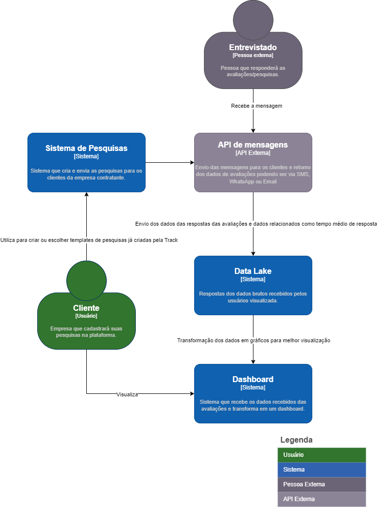
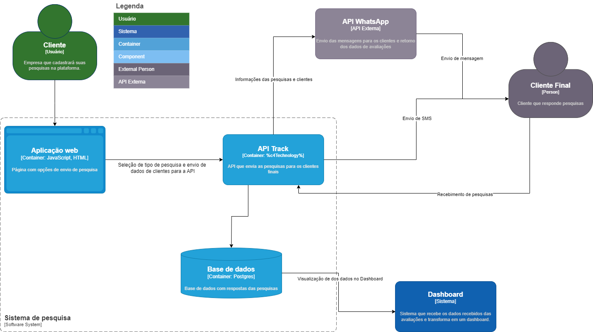
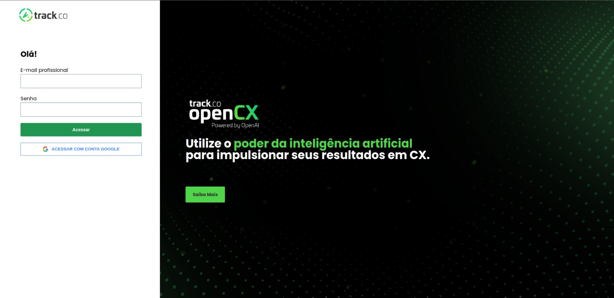
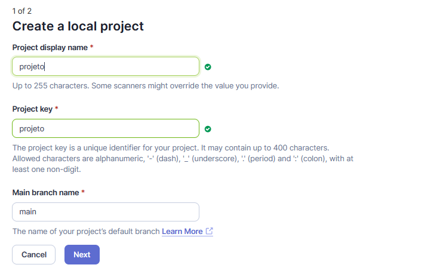
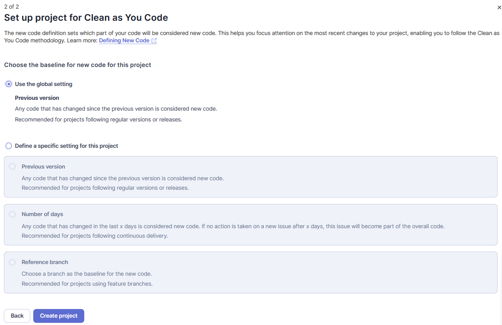
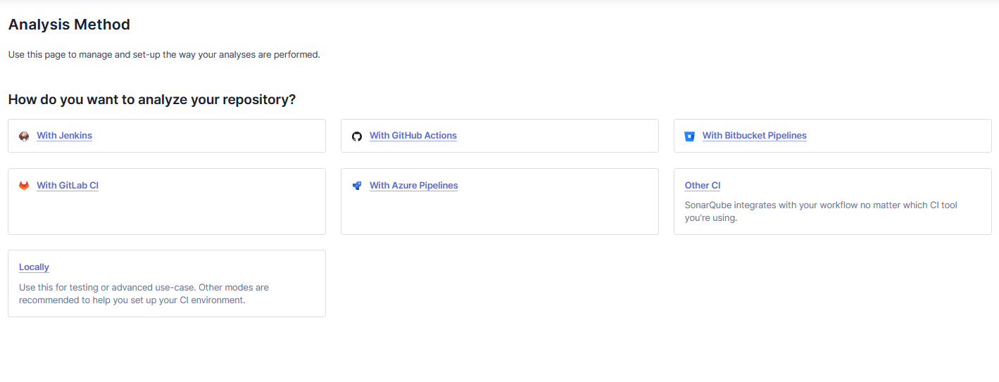
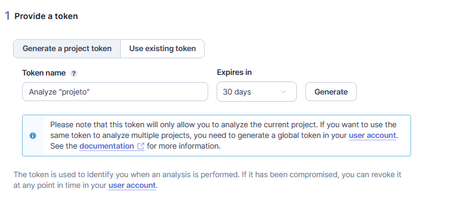
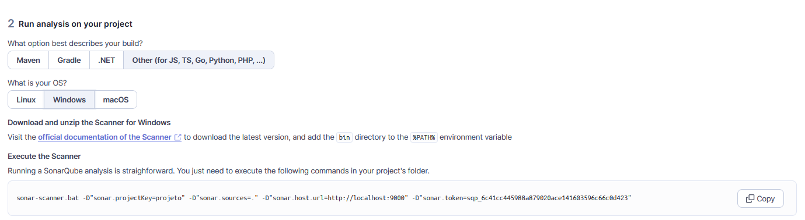

# Documentação do projeto - Arquitetura

## Sumário

1. [Introdução](#1-introdução)
2. [Diagrama C4](#2-diagrama-c4)
   - [Diagrama C4: Nível Contexto](#21-diagrama-c4-nível-contexto)
   - [Diagrama C4: Nível Contêiners](#22-diagrama-c4-nível-contêiner)
3. [Git Flow para organização do fluxo de trabalho](#3-git-flow-para-organização-do-fluxo-de-trabalho-e-gestão-de-versão-do-projeto)
4. [Versionamento semântico](#4-versionamento-semântico)
5. [Requisitos Funcionais](#5-requisitos-funcionais)
6. [Frontend](#6-frontend)
7. [Backend](#7-backend)
8. [Análise estática com SonarQube](#8-análise-estática-com-sonarqube)
9. [Implementação do serviço de Mensagens](#9-implementação-do-serviço-de-mensagens)

# 1. Introdução
O projeto, em colaboração com a Track.co, trata do metaprojeto do módulo 9 do curso de Engenharia de Software do Inteli: Construção de testes automatizados e controle de qualidade de software. <br>
Nele, serão aplicados os conceitos de qualidade de software em dois casos de uso da empresa, mais precisamente na área de distribuição de pesquisas avaliativas para os clientes finais. Isso garantirá uma maior confiabilidade no fluxo desse sistema.

# 2. Diagrama C4
O diagrama C4 é uma técnica de modelagem arquitetural que visa descrever a arquitetura de software em diferentes níveis de abstração, desde uma visão de contexto até detalhes mais específicos de componentes. Ele é composto por quatro tipos principais de diagramas:

**Contexto (Context Diagram)**: Este é o nível mais alto de abstração, mostrando o sistema em questão e seus principais relacionamentos com outros sistemas ou componentes externos.

**Contêineres (Container Diagram)**: Este diagrama descreve os principais componentes ou contêineres de software que compõem o sistema, bem como suas interações e dependências.

**Componentes (Component Diagram)**: Este nível de detalhe mostra os principais componentes dentro de cada contêiner, destacando suas relações e como se conectam para realizar as funcionalidades do sistema.

**Código (Code Diagram)**: Este é o nível mais detalhado, mostrando o código fonte dos componentes e como eles estão organizados dentro dos contêineres.

Esses diagramas ajudam a comunicar a arquitetura de software de forma clara e concisa, permitindo que os arquitetos e desenvolvedores entendam a estrutura do sistema e tomem decisões informadas durante o processo de desenvolvimento.

No nosso projeto, abordaremos os primeiros dois níveis do C4, a fim de facilitar o entendimento do negócio do parceiro e da solução proposta.

## 2.1 Diagrama C4: Nível Contexto

Segundo o próprio site do <a href="https://c4model.com"> diagrama C4</a>, um diagrama de contexto do sistema é um bom ponto de partida para diagramar e documentar um sistema de software, permitindo que você dê um passo atrás e veja o panorama geral. 

O detalhe não é importante aqui, pois esta é a sua visão ampliada mostrando uma visão geral da paisagem do sistema. O foco deve estar nas pessoas (atores, funções, personas, etc.) e nos sistemas de software, em vez de tecnologias, protocolos e outros detalhes de baixo nível. É o tipo de diagrama que você poderia mostrar para pessoas não técnicas.

O nosso diagrama mostra a relação entre o cliente, ou seja, a empresa que cadastrará suas pesquisas na plataforma com o software de Sistema de Pesquisas, que cria e envia as pesquisas para os clientes da empresa contratante. Ele faz isso usando uma API externa de mensagens, que pode ser enviada por email, SMS ou WhatsApp. O Entrevistado, que responde as avaliações, recebe a mensagem e envia os dados das respostas das avaliações e dados relacionados como tempo médio de resposta para o Data Lake da Track. Com base nesses dados, o sistema cria um dashboard em que o cliente pode visualizar o resultado das avaliações.

**Atores que interagem com o sistema:**
- Cliente: Empresa que contrata o serviço da Track. Exemplos de empresas clientes da Track.co são 99, Inter, Natura e Azul.
- Entrevistado: Pessoa que é cliente das empresas que contrataram o serviço da Track.co. É quem responde as pesquisas.

**Principais componentes do sistema:**
- Sistema de pesquisas: Sistema onde é feito a criação e envio das pesquisas disponibilizadas pela Track. 
- Data Lake: Base de dados em que fica disponibilizada as respostas fornecidas pelos entrevistados.
- Dashboard: Sistema que transforma os dados que estão no Data Lake em gráficos e formas mais eficientes de visualização
- API de mensagens: API que envia mensagens para os clientes em diversos canais, sendo eles: SMS, WhatsApp ou email.

**Relacionamento entre Atores e componentes do sistema:**
- A empresa, chamada de Cliente no diagrama, utiliza o componente de sistema 'Sistema de Pesquisas' para montar a pesquisa que deve ser enviada para os seus clientes (chamados de Entrevistado no diagrama). Além disso, ele escolhe em qual canal de comunicação essa pesquisa deve ser enviada. Por fim, ele publica a pesquisa.

- Quando a pesquisa é publicada usando a API Externa 'API de Mensagens', os clientes dessas empresas, representados pela célula Entrevistado no diagrama, respondem a pesquisa, que é enviada para o componente de sistema 'Data Lake'.

- No fim do fluxo, a empresa pode visualizar as respostas de seus usuários e tirar insights através do componente de sistema 'Dashboard'.

O Diagrama C4: Nível Contexto está disponível na imagem abaixo.



## 2.2 Diagrama C4: Nível Contêiner
Conforme o site mencionado anteriormente, um "contêiner" pode ser uma aplicação web do lado do servidor, uma aplicação de página única, uma aplicação de desktop, um aplicativo móvel, um esquema de banco de dados, um sistema de arquivos, entre outros. Basicamente, um contêiner é uma unidade separadamente executável/deployável (por exemplo, um espaço de processo separado) que executa código ou armazena dados.

O diagrama de Contêineres mostra o formato de alto nível da arquitetura de software e como as responsabilidades são distribuídas por ela. Também demonstra as principais escolhas tecnológicas e como os contêineres se comunicam entre si. É um diagrama simples, de alto nível, focado em tecnologia, que é útil tanto para desenvolvedores de software quanto para equipe de suporte/operações.

O diagrama abaixo demonstra o contêiner do Sistema de Pesquisa. Os componentes desse sistema são: Aplicação Web, onde o usuário pode vizualizar os tipos de pesquisa que serão enviados para os clientes finais, API Track, que faz o envio das pesquisas para os entrevistados da maneira que foi determinado pelo cliente da Track, sendo por SMS ou Whatsapp, além de receber as respostas das pesquisas atualizando a Base de dados, que armazena os dados das pesquisas, possibilitando a vizualização delas no Dashboard. Caso o tipo de pesquisa seja por Whatsapp, a API Track faz a comunicação com a API do Whatsapp para fazer o envio das pesquisas para os entrevistados.



# 3. Git Flow para organização do fluxo de trabalho e gestão de versão do projeto

O objetivo desse documento é discorrer sobre o processo adotado pelo time para utilização do Git Flow durante o processo de desenvolvimento do projeto em parceria com a startup Track.co, explicando seu funcionamento e evidenciando etapas.

## O que é Git Flow?

O Git Flow é um modelo de trabalho muito utilizado por equipes de desenvolvimento de software, cujo objetivo é auxiliar na organização do versionamento de códigos e dar mais fluidez ao processo de desenvolvimento, através da criação de padrões para branches de novas funcionalidades, correções de bugs e lançamento de versões.

## Organização do fluxo

O processo trabalha com duas branches principais e três branches de suporte temporárias:

**Principais**
- Main (produção)
- Develop (desenvolvimento)

**Suporte**
- Feature (novas funcionalidades)
- Release (ponte da branch Develop para a branch Main)
- Hotfix (para correções imediatas encontradas no ambiente de produção)

Nesse contexto, a branch ```main``` é a principal linha de desenvolvimento, refletindo a versão mais estável do software em produção. Por outro lado, a branch ```develop``` atua como a versão contínua de desenvolvimento, integrando diferentes funcionalidades desenvolvidas pela equipe antes de serem mergeados para a ```main```.

Para introduzir novas funcionalidades, utiliza-se a branch ```feature```, criada a partir da ```develop```. Essa abordagem permite isolar o trabalho em uma feature específica, que, após conclusão, é mergeada de volta para a ```develop```.

Quando o código atinge um ponto de estabilidade na branch ```develop```, é criada a branch ```release```. Nela, são realizados ajustes finais, como correções de bugs e atualizações de versão, antes de ser mergeada tanto para a ```main``` quanto para a ```develop```.

Por fim, em situações de correções críticas em produção, o Gitflow propõe a criação da branch ```hotfix```, derivada da ```main```. Após a implementação da correção, ela é mergeada tanto para a ```main``` quanto para a ```develop```, assegurando que a correção seja refletida nas versões em produção e em desenvolvimento.

# 4. Versionamento semântico

## O que é Versionamento semântico?

O versionamento semântico, também conhecido como SemVer (Semantic Versioning), é um conjunto de regras e convenções para atribuir versões a software, com o objetivo de facilitar a compreensão das mudanças e garantir a compatibilidade entre diferentes versões.

## Formato do Versionamento Semântico 
  

O SemVer é composto por três números inteiros separados por pontos (por exemplo, 1.2.3), que representam, respectivamente, a versão principal (major), a versão secundária (minor) e a versão de correção (patch). As regras básicas do SemVer são as seguintes:

- **Major (versão principal):** o primeiro dígito informa a versão de compatibilidade e é alterado caso o software ou biblioteca sofra mudanças que a torne incompatível com outras versões. São as chamadas breaking changes, atualizações que possuem o potencial de “quebrar” códigos que utilizam versões anteriores.
- **Minor (versão secundária):** o segundo dígito informa a versão da funcionalidade, onde uma nova função ou melhoria substancial é adicionada e não há problemas de incompatibilidade com outras versões.
- **Patch (correção):** o terceiro dígito informa a versão da correção de bugs, melhorias de desempenho ou alterações similares que não alteram as funcionalidades atuais e nem introduzem novas.

## Regras de publicação de software

- Um número de versão tem o formato X.Y.Z, onde X, Y e Z são inteiros não negativos e não devem conter zeros à esquerda. X é a versão major (maior), Y é a versão minor (menor) e Z é a versão patch (correção).
- Cada número da versão deve aumentar numericamente, ou seja, não podemos ter uma versão 1.0.0 e uma versão 3.0.0 sem que exista uma versão 2.0.0, por exemplo.
- No início do desenvolvimento, a versão Maior deve ser zero (0.y.z).
- A versão 1.0.0 define a API como pública (aquela que foi lançada e está disponível para o público). A maneira como o número de versão é incrementado após este lançamento é dependente da API pública e como ela muda.

## Instruções para utilização do Git Flow 

**1º passo:** Iniciar o Git Flow
```
git flow init
```

### Feature

**1º passo:** ir para a branch ```develop```
```
git checkout develop
```

**2º passo:** criar uma branch utilizando Git Flow
```
git flow feature start NOME DA BRANCH
```

**3º passo:** dar commit e push para o github
```
git add .
git commit -m "MENSAGEM"
git push --set-upstream origin feature/NOME DA BRANCH
```

**4º passo:** voltar para a branch ```develop```
```
git checkout develop
```

**5º passo:** finalizar a branch
```
git flow feature finish NOME DA BRANCH
```

**6º passo:** subir para o Github
```
git push origin develop
```

### Hotfix

**1º passo:** ir para a branch ```main```
```
git checkout main
```

**2º passo:** criar uma branch utilizando Git Flow
```
git flow hotfix start NOME DA BRANCH
```

**3º passo:** dar commit e push para o github
```
git add .
git commit -m "MENSAGEM"
git push --set-upstream origin hotfix/NOME DA BRANCH
```

**4º passo:** voltar para a branch ```main```
```
git checkout main
```

**5º passo:** finalizar a branch
```
git flow hotfix finish NOME DA BRANCH
```
*COLOCAR MENSAGEM DA TAG, DAR CTRL+C, DIGITAR ':wq' e APERTAR ENTER


**6º passo:** subir para o Github
```
git push origin main
git push origin develop
```

### Release

**1º passo:** ir para a branch ```develop```
```
git checkout develop
```

**2º passo:** criar uma branch utilizando Git Flow
```
git flow release start NUMERO DA VERSÃO
```

**3º passo:** dar commit e push para o github
```
git add .
git commit -m "MENSAGEM"
git push --set-upstream origin release/NUMERO DA VERSÃO
```

**4º passo:** finalizar a branch
```
git flow release finish NUMERO DA VERSÃO
```
*COLOCAR MENSAGEM DA TAG, DAR CTRL+C, DIGITAR ':wq' e APERTAR ENTER


**5º passo:** subir para o Github
```
git push origin main
git push origin develop
```

## Padrão de criação de branch

Utilizando o gitflow, branches para ```feature```, ```hotfix``` e ```release``` são criadas automaticamente. No entanto, caso o Git Flow não seja utilizado, o padrão a seguir deverá ser seguido:

`feature/NOME DA BRANCH` **(a partir da develop):** para adição de novas funcionalidades <br>
`release/NUMERO DA VERSÃO` **(a partir da develop):** junção de features e correção de bugs para subir para produção. Serve como ambiente de homologação.<br>
`hotfix/NOME DA BRANCH` **(a partir da main):** para correção de bugs localizados em produção, com urgência. <br>
`bugfix/NOME DA BRANCH` **(a partir da develop):** utilizada para correção de bugs localizados no ambiente de desenvolvimento.<br>
`support/NUMERO DA VERSÃO` **(a partir da main):** para correção de bugs localizados em produção, sem tanta urgência. Correção deverá ser adicionada tanto na ```main``` como na ```develop```. <br>
`docs/NOME DA BRANCH` **(a partir da develop):** para atualização de documentação, sem alterações em código.

## Padrão de commits

`feat:` adiciona nova funcionalidade <br>
`fix:` corrige um bug <br>
`docs:` atualiza documentação <br>
`chore:` realiza tarefas de manutenção <br>
`test:` adiciona testes <br>
`style:` realiza ajustes de formatação <br>
`refactor`: ajustes de refatoração

# 5. Requisitos Funcionais 

[Tabela dos Requisitos funcionais](https://docs.google.com/spreadsheets/d/17deVEHaeJGF3afG24_fUSqt0hUdRkPai6Ob7iRd5uJ4/edit?usp=sharing)

# 6. Frontend
## 6.1 Tecnologias utilizadas
- Angular framework
- Typescript
- Jasmine e Karma - testes
- Axios

## 6.2 Como rodar o projeto - localmente
Executar os seguintes comandos , dentro da pasta [src/frontend](../src/frontend/) :
-      npm i
-     ng serve

## 6.3 Como rodar os testes - localmente
Executar os seguintes comandos , dentro da pasta [src/frontend](../src/frontend/) :
-      ng run tests

## 6.4 Práticas de segurança adotadas
- Integração ao sistema de autenticação do Firebase para o login no sistema.
- Meios de login utilizados: email com senha, e conta do google.
- Possibilita um bloqueio a todas as rotas da plataforma por meio da url, sendo a /login a rota default.
  
  

  Para garantir a privacidade e segurança dos dados, bem como manter a sincronização dos dados do usuário em diferentes dispositivos, optamos por integrar o serviço de autenticação do Firebase, da Google, em nosso sistema.

  O Firebase Authentication é uma plataforma robusta que permite aos desenvolvedores implementarem funcionalidades de login e registro em seus aplicativos, oferecendo suporte a diversos métodos de autenticação, como email, senha, número de telefone, contas Google, Facebook, Twitter, Github, entre outros. Além disso, o Firebase Authentication disponibiliza ferramentas para gerenciamento de usuários, incluindo redefinição de senha e verificação de email.

  Uma funcionalidade importante do Firebase Authentication é a autenticação anônima, que permite aos usuários acessarem temporariamente o aplicativo de forma anônima, com a possibilidade de atualizar essa conta anônima para uma conta normal posteriormente.

  Para atender aos requisitos do nosso sistema e dos nossos parceiros, optamos por utilizar a autenticação por email e senha, além da autenticação com conta do Google.

  Uma implementação relevante que realizamos foi a integração com o AuthGuard do Angular, que é responsável por proteger as rotas da aplicação com base na presença de um token de acesso válido. O AuthGuard implementa a interface CanActivate, exigindo a implementação do método canActivate(), que retorna um booleano ou uma Promise/observable que resolva para um booleano. Em nosso AuthGuard, utilizamos o serviço JwtHelperService do pacote @auth0/angular-jwt para verificar a validade do token de acesso armazenado no localStorage.

  Essa abordagem é fundamental para garantir que apenas usuários autenticados e autorizados possam acessar as rotas protegidas da aplicação, seguindo as práticas recomendadas para aplicações web que utilizam tokens JWT para autenticação.

# 7. Backend
## 7.1 Tecnologias utilizadas
- Node.js
- Express
- Typescript
- Prisma (ORM)
- Postgres

## 7.2 Como rodar o projeto - localmente
Para rodar o back-end localmente, navegue até a pasta backend do projeto e siga esse passo-a-passo:
1. Execute o comando:
-     npm i
2. Após, execute os seguintes comandos no terminal para executar a imagem Docker:
-     docker pull postgres

3. Neste comando, troque o campo 'mysecretpassword' pela senha do repositório. 
(Para professores, a senha está disponível no Slack da turma.)

-     docker run --name some-postgres -e POSTGRES_PASSWORD=mysecretpassword -d postgres

4. Crie o arquivo `.env` com as credenciais necessárias (disponivel no slack para os professores)
5. Após o processamento das imagens, rode o comando:
-      npm run start

## 7.3 Documentação com Swagger

O back-end da aplicação está documentado no Swagger. Para acessar, basta rodar a aplicação (veja instruções na seção anterior), abrir o navegador e na barra de pesquisa, escrever `localhost:8080/api-docs`


# 8. Análise estática com SonarQube

## 8.1 Instalação da Ferramenta do SonarQube e Configuração das Regras Customizadas
O SonarQube é uma poderosa ferramenta de inspeção de código que permite aos desenvolvedores identificar problemas e vulnerabilidades em seu código-fonte. Este guia aborda a instalação do SonarQube usando Docker e como configurar regras customizadas para análise de código.

### Executar SonarQube com Docker
- **Pré-requisitos**: Certifique-se de ter o Docker instalado e funcionando em seu sistema.
- **Rodar o SonarQube no Docker**: Abra um terminal e execute o comando abaixo para iniciar uma instância do SonarQube:
`docker run -d --name sonarqube -p 9000:9000 -p 9092:9092 sonarqube`.
Este comando baixa a imagem do SonarQube do Docker Hub e inicia um container chamado sonarqube, acessível através da porta 9000.

### Acessar o SonarQube: 
Abra um navegador e acesse http://localhost:9000. As credenciais padrão são:
- Usuário: admin
- Senha: admin

### Configuração da análise estática do projeto
- **Login no SonarQube**: Faça login usando as credenciais mencionadas acima.
- **Mude as Credenciais**: Após o login, você será solicitado a alterar a senha padrão. Siga as instruções para alterar a senha.
- **Criar um Novo Projeto**: No painel do SonarQube, clique em "Create new project" para criar um novo projeto.


- **Configuração do Projeto**: Durante a criação do projeto, defina o local e nome do projeto, selecione a opção _*Use the global setting*_ para a configuração e escolha o método de análise como _*Locally*_.



- **Geração de Token**: Conforme instruído, gere um token de autenticação. Este token será usado nos comandos de análise para autenticar no SonarQube.


- **Executar a Análise**: Siga os passos fornecidos pelo SonarQube, que incluirão a execução de comandos no seu terminal local para iniciar a análise do código do seu projeto. Para este projeto, selecionamos a opção _*Other*_ para a linguagem de programação. Para executar a análise, siga as instruções dadas pelo SonarQube, e use o comando fornecido dentro da pasta que contém o código-fonte do projeto.


 - **Observações:** Não se esqueça de alterar as variáveis de ambiente do seu sistema, como instruído pelo SonarQube. Essa instrução não é muito clara no momento de criação da análise.

### Adicionando Regras Customizadas
Para adicionar  regras customizadas após a instalação e configuração inicial, siga estes passos:

- **Acessar as Configurações do Projeto**: No painel do SonarQube, vá até as configurações do seu projeto.
- **Regras**: Navegue até a seção de Regras e procure por regras específicas ou por linguagens de programação relevantes ao seu projeto.
- **Customização**: Você pode ativar ou desativar regras específicas, bem como criar regras customizadas, dependendo das necessidades específicas do seu projeto.


# 9. Implementação do serviço de Mensagens

# Documentação - Envio de Mensagem por SMS usando Twilio

## Introdução

O envio de mensagens por SMS é uma parte fundamental da distribuição de pesquisas, permitindo alcançar os clientes de forma rápida e eficaz. No projeto, utilizamos o Twilio, um serviço de comunicação em nuvem que facilita o envio de SMS e outros tipos de mensagens.

## Justificativa do não uso da API da Track

Optamos por não utilizar a API de envio de mensagens da Track devido a problemas com as credenciais de acesso fornecidas, que não eram válidas. Ao reportar o problema ao orientador, ele tentou contatar a Track, porém não obteve resposta sobre o assunto. Além disso, enfrentamos outro obstáculo com a API, que era o bloqueio após 3 requisições realizadas. Ou seja, a cada 3 requisições, a API era bloqueada por 5 minutos, o que tornava inviável o seu uso para o nosso propósito.

## Configuração do Twilio

Vocẽ pode acessar o arquivo em questão [neste link!](https://github.com/Inteli-College/2024-T0003-ES09-G02/blob/main/src/backend/utils/sendSms.ts)

Para começar, foi necessário criar uma conta no Twilio e obter as credenciais necessárias: `TWILIO_ACCOUNT_SID` e `TWILIO_AUTH_TOKEN`. Essas credenciais são usadas para autenticar as requisições ao serviço Twilio.

Além disso, é importante comprar e definir um número de telefone Twilio (`TWILIO_MY_NUMBER`) que será utilizado como remetente das mensagens.

## Criptografia do Token

Para garantir a segurança da URL da pesquisa enviada por SMS, utilizamos a criptografia do número de telefone do destinatário. O token criptografado é passado como parâmetro na URL da pesquisa.

É importante manter em segredo a chave de criptografia (`SECRET_KEY`) e o algoritmo de criptografia (`ALGORITHM_NAME`) para garantir a integridade do token.

## Função de Envio de SMS

A função `sendSMS` é responsável por enviar a mensagem por SMS para o número de telefone do destinatário. Ela recebe como parâmetros o número de telefone (`toNumber`), o nome do destinatário (`name`), a mensagem da pesquisa (`message`) e o ID da distribuição (`distribution_id`).

A mensagem enviada contém um link para a pesquisa, onde o destinatário pode acessar e responder. O link contém o token criptografado e o ID da distribuição.

## Controller

Vocẽ pode acessar o arquivo em questão [neste link!](https://github.com/Inteli-College/2024-T0003-ES09-G02/blob/main/src/backend/controllers/DistribuitionController.ts)

No controller, temos a função `createDistribuition`, que é responsável por criar uma nova distribuição da pesquisa. Ela recebe as informações da distribuição, incluindo o arquivo CSV com os números de telefone dos destinatários.

Após criar a distribuição, o controller faz o upload do arquivo CSV e valida a distribuição. Em seguida, itera sobre a lista de destinatários e envia a mensagem por SMS para cada um deles utilizando a função `sendSMS`.

## Validação do Arquivo CSV

Vocẽ pode acessar o arquivo em questão [neste link!](https://github.com/Inteli-College/2024-T0003-ES09-G02/blob/main/src/backend/validation/ValidateCsvFile.ts)

A função `ValidateCsvFile` é responsável por validar o arquivo CSV com os números de telefone dos destinatários. Ela verifica se os números de telefone são válidos e adiciona um campo `isValid` aos registros do arquivo CSV.

## Conclusão

O envio de mensagens por SMS usando Twilio permite alcançar os clientes de forma eficiente. Com a criptografia do token e a validação do arquivo CSV, garantimos a segurança e integridade dos dados enviados.
