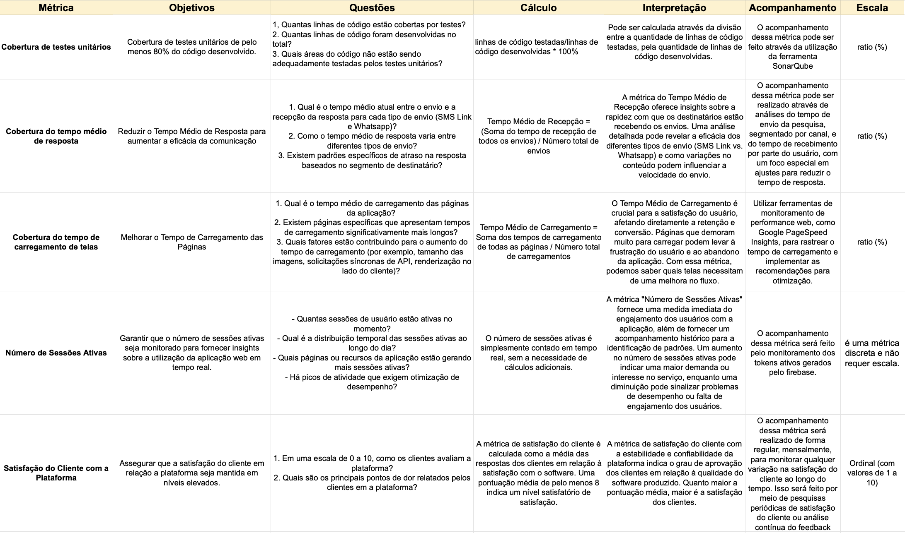
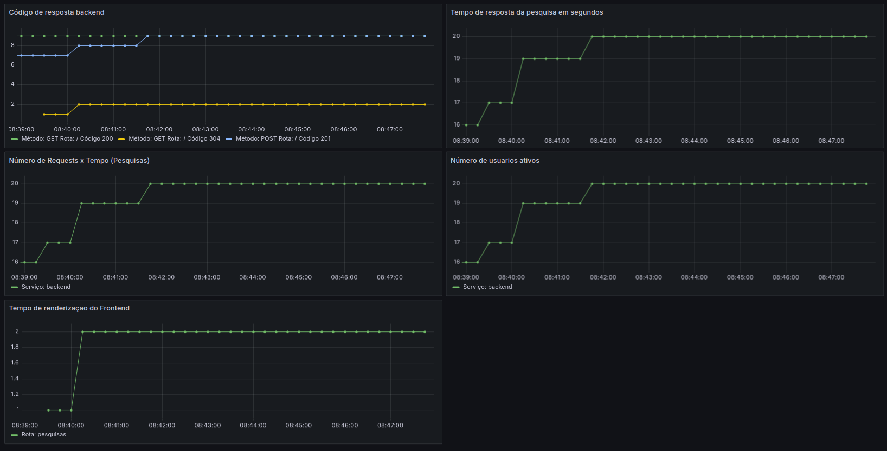
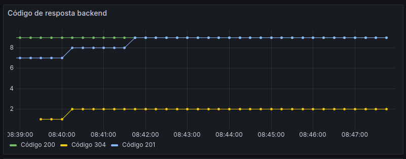
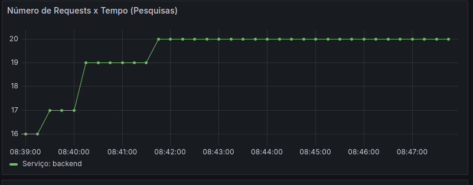
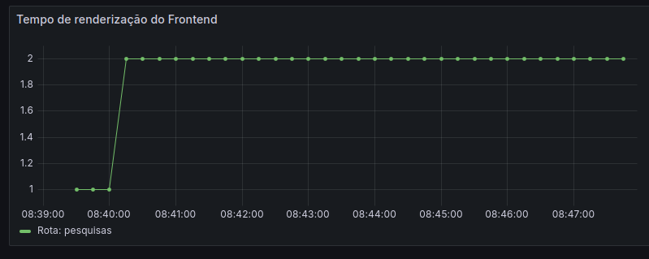
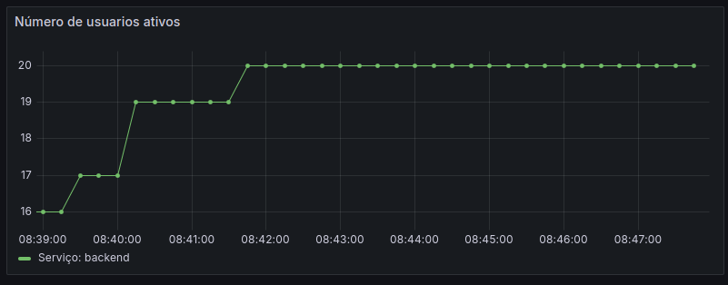

# Métricas

## Sumário
1. [Introdução](#1-introdução)
  - 1.1 [Métrica: Cobertura de Testes Unitários](#11-métrica-cobertura-de-testes-unitários)
  - 1.2 [Métrica: Cobertura do Tempo Médio de Resposta](#12-métrica-cobertura-do-tempo-médio-de-resposta)
  - 1.3 [Métrica: Cobertura do Tempo de Carregamento de Telas](#13-métrica-cobertura-do-tempo-de-carregamento-de-telas)
  - 1.4 [Métrica: Número de Sessões Ativas](#14-métrica-número-de-sessões-ativas)
  - 1.5 [Métrica: Satisfação do Cliente com a Plataforma](#15-métrica-satisfação-do-cliente-com-a-plataforma)
2. [Dashboard de monitoramento](#2-dashboard-de-monitoramento)

# 1. Introdução
Este documento descreve as métricas de qualidade do software utilizadas no nosso projeto, bem como os objetivos, as questões associadas, os cálculos, o acompanhamento e a avaliação de cada métrica. É possível ver um quadro das métricas abaixo.



### 1.1 Métrica: Cobertura de Testes Unitários
- Objetivo:
  - Alcançar uma cobertura de testes unitários de pelo menos 80% do código desenvolvido.
- Questões:
  1. Quantas linhas de código estão cobertas por testes?
  2. Quantas linhas de código foram desenvolvidas no total?
  3. Quais áreas do código não estão sendo adequadamente testadas pelos testes unitários?
- Cálculo:
  - Cobertura de Testes Unitários = (Linhas de código testadas / Linhas de código desenvolvidas) * 100%
- Interpretação:
  - A cobertura de testes unitários indica a proporção do código que está sendo testada. Uma cobertura mais alta sugere uma maior confiabilidade do software.
- Acompanhamento:
  - Utilização da ferramenta SonarQube para monitorar a cobertura de testes unitários.
- Escala: Ratio

### 1.2 Métrica: Cobertura do Tempo Médio de Resposta
- Objetivo:
  - Reduzir o Tempo Médio de Resposta para aumentar a eficácia da comunicação.
- Questões:
  1. Qual é o tempo médio atual entre o envio e a recepção da resposta para cada tipo de envio (SMS Link e Whatsapp)?
  2. Como o tempo médio de resposta varia entre diferentes tipos de envio?
  3. Existem padrões específicos de atraso na resposta baseados no segmento de destinatário?
- Cálculo:
  - Tempo Médio de Recepção = (Soma do tempo de recepção de todos os envios) / Número total de envios
- Interpretação:
  - O tempo médio de resposta oferece insights sobre a rapidez com que os destinatários estão recebendo os envios, permitindo ajustes para otimização.
- Acompanhamento:
  - Análise do tempo de envio e recebimento por meio de ferramentas de análise de dados.
- Escala: Ratio

### 1.3 Métrica: Cobertura do Tempo de Carregamento de Telas
- Objetivo: 
  - Melhorar o Tempo de Carregamento das Páginas.
- Questões:
  1. Qual é o tempo médio de carregamento das páginas da aplicação?
  2. Existem páginas específicas que apresentam tempos de carregamento significativamente mais longos?
  3. Quais fatores estão contribuindo para o aumento do tempo de carregamento?
- Cálculo:
  - Tempo Médio de Carregamento = Soma dos tempos de carregamento de todas as páginas / Número total de carregamentos
- Interpretação:
  - O Tempo Médio de Carregamento é crucial para a satisfação do usuário, afetando diretamente a retenção e conversão. Páginas que demoram muito para carregar podem levar à frustração do usuário e ao abandono da aplicação. Com essa métrica, podemos saber quais telas necessitam de uma melhora no fluxo.
- Acompanhamento:
  - Utilização de ferramentas de monitoramento de performance web, como Google PageSpeed Insights.
- Escala: Ratio

### 1.4 Métrica: Número de Sessões Ativas
- Objetivo:
  - Garantir que o número de sessões ativas seja monitorado para fornecer insights sobre a utilização da aplicação web em tempo real.
- Questões:
    1. Quantas sessões de usuário estão ativas no momento?
    2. Qual é a distribuição temporal das sessões ativas ao longo do dia?
    3. Quais páginas ou recursos da aplicação estão gerando mais sessões ativas?
    4. Há picos de atividade que exigem otimização de desempenho?
- Cálculo:
  - O número de sessões ativas é simplesmente contado em tempo real, sem a necessidade de cálculos adicionais.
- Interpretação:
  - A métrica "Número de Sessões Ativas" fornece uma medida imediata do engajamento dos usuários com a aplicação, além de fornecer um acompanhamento histórico para a identificação de padrões. Um aumento no número de sessões ativas pode indicar uma maior demanda ou interesse no serviço, enquanto uma diminuição pode sinalizar problemas de desempenho ou falta de engajamento dos usuários.
- Acompanhamento:
  - O acompanhamento dessa métrica será feito pelo monitoramento dos tokens ativos gerados pelo firebase.
- Escala:
- O número de sessões ativas é uma métrica discreta e não requer escala.

### 1.5 Métrica: Satisfação do Cliente com a Plataforma
- Objetivo: 
  - Assegurar que a satisfação do cliente em relação a plataforma seja mantida em níveis elevados.
- Questões:
  1. Em uma escala de 0 a 10, como os clientes avaliam a plataforma?
  2. Quais são os principais pontos de dor relatados pelos clientes em a plataforma?
- Cálculo:
  - A métrica de satisfação do cliente é calculada como a média das respostas dos clientes em relação à satisfação com o software. Uma pontuação média de pelo menos 8 indica um nível satisfatório de satisfação.
- Interpretação:
  - A métrica de satisfação do cliente com a estabilidade e confiabilidade da plataforma indica o grau de aprovação dos clientes em relação à qualidade do software produzido. Quanto maior a pontuação média, maior é a satisfação dos clientes.
- Acompanhamento:
  - O acompanhamento dessa métrica será realizado de forma regular, mensalmente, para monitorar qualquer variação na satisfação do cliente ao longo do tempo. Isso será feito por meio de pesquisas periódicas de satisfação do cliente ou análise contínua do feedback recebido.
- Escala: Ordinal (com valores de 1 a 10)

# 2. Dashboard de monitoramento

## 2.1 Implantação de Instrumentação APM na Aplicação

### Instrumentação APM
A aplicação foi devidamente instrumentada para monitoramento de desempenho e métricas essenciais. As métricas são coletadas através do Prometheus, e a visualização desses dados é realizada pelo Grafana. A instrumentação abrange tanto aspectos tecnológicos quanto de negócios, garantindo uma visão completa do estado da aplicação.

### Métricas Coletadas
As métricas coletadas incluem, mas não se limitam a:
- Tempo de resposta das APIs (REST API response time)
- Número total de requisições (Total number of requests)
- Número total de usuários ativos (Total number of active users)
- Tempo de carregamento das telas (Load time of screens)
- Taxa de satisfação dos usuários (Satisfaction rate)
- Tempo de resposta de pesquisas (Response time of surveys)
- Número de requisições feitas por cada cliente (Number of requests made by each client)

## 2.2 Configuração de Persistência de Métricas e Dashboards

### Persistência de Métricas
As métricas coletadas são persistentes, garantindo que dados históricos estejam disponíveis para análise retrospectiva e tendências ao longo do tempo. Isso é alcançado através do Prometheus, que armazena as métricas coletadas em um formato eficiente e acessível.

### Dashboards
Os dashboards foram configurados usando o Grafana para oferecer uma visualização clara e abrangente das métricas coletadas. Os dashboards foram desenhados de forma  bem estruturados para permitirem uma rápida compreensão do estado da aplicação em termos de tecnologia e negócios. As métricas são apresentadas de forma visualmente atraente e informativa, por gráficos, facilitando a identificação de tendências e problemas.

## 2.3 Documentação do Processo de Monitoramento

### Configuração e Implantação do Sistema de Monitoramento

Para configurar e implantar o sistema de monitoramento, siga os passos abaixo:

#### Prometheus:
1. Faça o download do Prometheus no site oficial ou utilizando um gerenciador de pacotes.
2. Configure o arquivo de configuração `prometheus.yml` para definir os alvos de scraping e outras configurações necessárias.
3. Execute o Prometheus usando o comando apropriado para o seu sistema operacional.
4. Verifique se o Prometheus está funcionando corretamente acessando http://localhost:9090 no seu navegador.

Arquivo de configuração :

```
global:
  scrape_interval: 15s

scrape_configs:
  - job_name: 'backend'
    static_configs:
      - targets: ['host.docker.internal:9100']
```

A primeira linha define a frequência com que o Prometheus vai coletar as métricas de todos os alvos configurados. Neste caso, a configuração `scrape_interval` está definida como `15s`, o que significa que o Prometheus vai coletar as métricas a cada 15 segundos.

A configuração de scraping é definida dentro da lista `scrape_configs`, que contém uma série de configurações para diferentes jobs de scraping. Neste caso, há apenas um job do nosso serviço chamado "backend".

- `job_name`: O nome do job de scraping, neste caso, "backend".
- `static_configs`: Configurações estáticas para este job, onde os alvos de scraping são definidos.

Dentro de `static_configs`, a lista de `targets` define os endereços dos alvos que o Prometheus vai acessar para coletar métricas. No exemplo, o target é `'host.docker.internal:9100'`, o que indica que o Prometheus vai coletar métricas do serviço que está rodando no host local na porta `9100`. O uso de `host.docker.internal` permite ao Prometheus acessar o serviço que está rodando na máquina host quando o Prometheus está rodando em um contêiner Docker.

#### Grafana:
1. Baixe e instale o Grafana a partir do site oficial ou utilizando um gerenciador de pacotes.
2. Inicie o servidor Grafana usando o comando apropriado.
3. Acesse o Grafana através do navegador, geralmente em http://localhost:3000.
4. Faça login com as credenciais padrão ou as credenciais configuradas durante a instalação.
5. Configure o Prometheus como a fonte de dados padrão para o Grafana.
6. Importe os dashboards necessários para visualizar as métricas da sua aplicação.

### Dependências da Aplicação
Certifique-se de que as seguintes dependências estejam instaladas e configuradas na sua aplicação antes de prosseguir com a instrumentação, algumas delas são:

- Express
- Prom-client
- Cors
- Prisma Client
- Response-time

Para instalar essas dependências, execute `npm install` no diretório raiz do projeto backend.

## 2.4 Uso e Manutenção

### Uso do Grafana
Para visualizar as métricas da aplicação no Grafana, siga estas etapas:

1. Acesse o Grafana através do navegador.
2. Navegue até o dashboard que contém as métricas da aplicação.
3. Use os filtros e painéis disponíbilizados para visualizar diferentes aspectos das métricas, como tempo de resposta, número de requisições e usuários ativos.
4. Explore os dados utilizando consultas personalizadas para obter insights adicionais para o negócio.

### Procedimentos de Manutenção
Para manter o sistema de monitoramento e adicionar novas métricas, siga estas diretrizes:

- Para adicionar novas métricas a aplicação, atualize o arquivo `metrics.ts` com as métricas desejadas e os endpoints correspondentes para atualização dessas métricas.
- Certifique-se de registrar corretamente as métricas no Prometheus para que possam ser visualizadas no Grafana.
- Se necessário, atualize os dashboards do Grafana para incluir as novas métricas ou ajustar os painéis existentes conforme necessário.
- Monitore regularmente o desempenho da aplicação através do Grafana e resolva quaisquer problemas ou anomalias que surgirem.

## 2.5 Qualidade e Clareza das Informações no Dashboard

Esta seção detalha a implementação e configuração de monitoramento de performance da aplicação (APM) usando Grafana para visualização. O objetivo é garantir visibilidade abrangente em métricas essenciais, tanto de tecnologia quanto de negócios, para a aplicação. Segue abaixo a visualização geral do nosso Dashboard, após isso a explicação individual de cada gráfico:



### **1. Código de resposta do backend:**



Este gráfico monitora os códigos de status HTTP das respostas do backend, permitindo identificar rapidamente respostas bem-sucedidas (códigos 2XX) e falhas (erros 4XX/5XX). Insights importantes que podem ser obtidos com esse gráfico incluem:

- Taxa de sucesso das requisições: Monitorar a proporção de respostas bem-sucedidas em relação ao total de requisições pode indicar a estabilidade e a qualidade do serviço.
- Identificação de problemas: Variações inesperadas nos códigos de resposta podem indicar problemas no backend que precisam ser investigados e corrigidos.

Essas informações são cruciais para garantir a qualidade do serviço oferecido pela empresa, especialmente ao distribuir pesquisas por SMS, onde a confiabilidade e a eficiência do backend são essenciais para garantir que as mensagens sejam entregues e as respostas sejam processadas adequadamente.

### **2. Tempo de resposta do backend:**


Esse gráfico rastreia o tempo de resposta do backend em segundos, sendo fundamental para avaliar a latência e a eficiência da aplicação. Alguns insights que podem ser obtidos com esse gráfico incluem:

- Performance do sistema: Monitorar o tempo de resposta ao longo do tempo ajuda a identificar tendências de melhoria ou degradação da performance do backend.
- Identificação de gargalos: A análise do tempo de resposta pode ajudar a identificar pontos de estrangulamento na aplicação, permitindo a otimização e melhorias no desempenho.

Para a distribuição de pesquisas por SMS, um backend com tempo de resposta baixo é crucial, garantindo que as mensagens sejam entregues rapidamente e que as respostas dos clientes sejam processadas sem demora.

### **3. Número de requests x tempo (Pesquisas):**



Esse gráfico mostra a contagem de requisições ao serviço de backend ao longo do tempo, refletindo a carga de trabalho e o uso do serviço. Insights importantes incluem:

- Tendências de utilização: Monitorar o número de requisições ao longo do tempo pode revelar padrões de uso do serviço, como picos de demanda em determinados horários.
- Planejamento de capacidade: Com base nas tendências de utilização, é possível planejar adequadamente a capacidade do serviço para atender à demanda, evitando sobrecargas ou recursos ociosos.

Para a distribuição de pesquisas por SMS, entender a carga de trabalho do serviço é essencial para garantir que ele tenha a capacidade necessária para lidar com o volume de mensagens enviado e recebido.

### **4. Tempo de renderização do frontend:**



Esse gráfico avalia o tempo necessário para renderizar componentes no frontend, impactando diretamente na experiência do usuário. Insights importantes incluem:

- Performance do frontend: Monitorar o tempo de renderização ajuda a identificar áreas do frontend que podem ser otimizadas para melhorar a experiência do usuário.
- Impacto nas interações do usuário: Um tempo de renderização baixo resulta em uma experiência mais fluida para o usuário, enquanto um tempo alto pode causar frustração e redução da interação com o sistema.

Para a distribuição de pesquisas por SMS, um frontend com bom desempenho é importante para garantir que os usuários consigam acessar e responder às pesquisas de forma rápida e sem problemas.

### **5. Número de usuários ativos:**



Esse gráfico registra o número de usuários ativos na aplicação, fornecendo insights sobre a utilização do sistema. Insights importantes incluem:

- Tendências de uso: Monitorar o número de usuários ativos ao longo do tempo ajuda a identificar padrões de uso da aplicação, como horários de pico de utilização.
- Engajamento do usuário: Um aumento no número de usuários ativos pode indicar um aumento no engajamento com a aplicação, enquanto uma queda pode indicar problemas que precisam ser investigados.

Para a distribuição de pesquisas por SMS, entender o número de usuários ativos é importante para avaliar a eficácia da distribuição e o engajamento dos usuários com as pesquisas.

## 2.6 Vídeo da explicação da arquitetura e demonstração da ferramenta de APM

Para acessar o vídeo, segue [link](https://drive.google.com/drive/folders/1ZMh4u0IFT6neyOrSkqLKqkTZC_XjnVis?usp=sharing) do drive onde ele está inserido.
