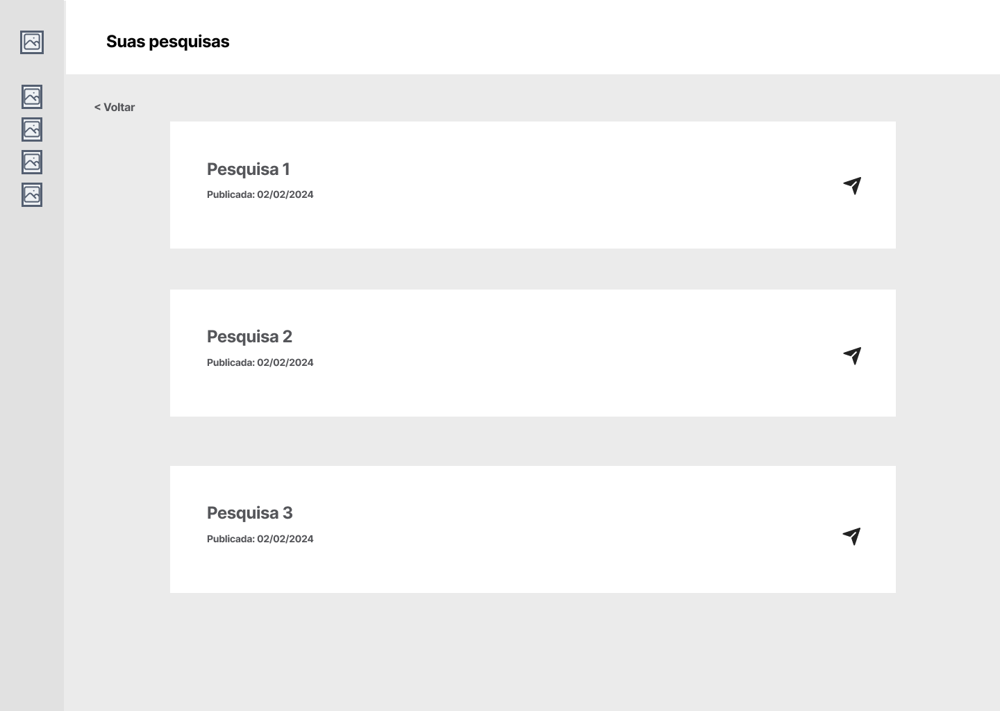
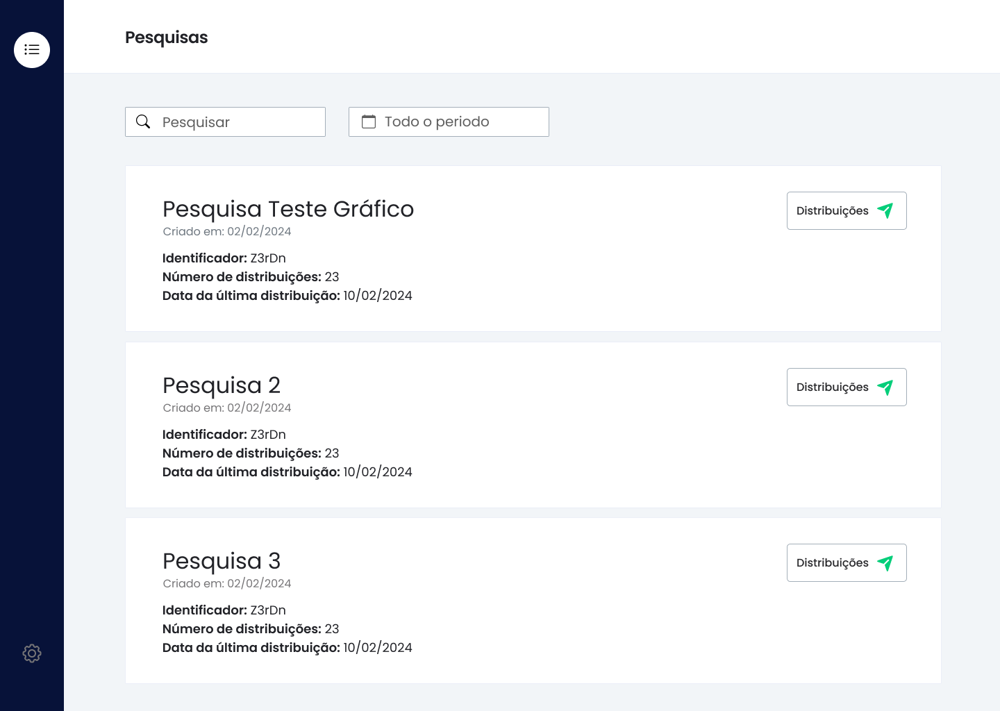
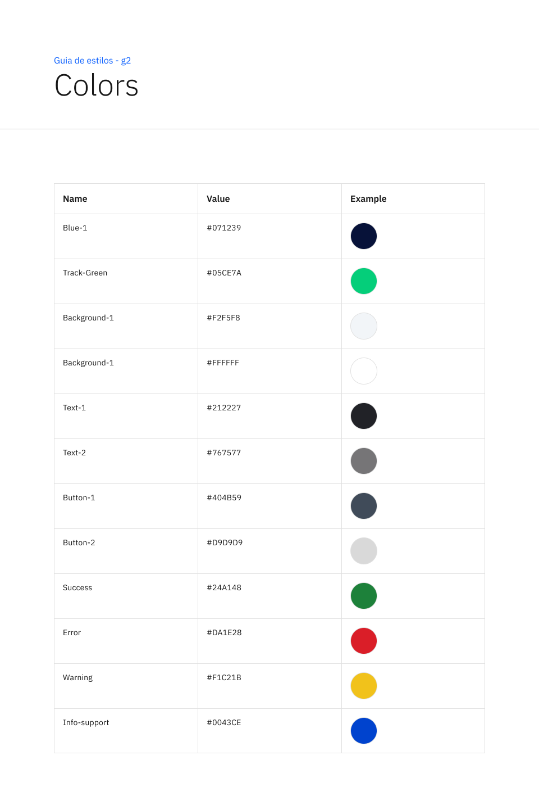
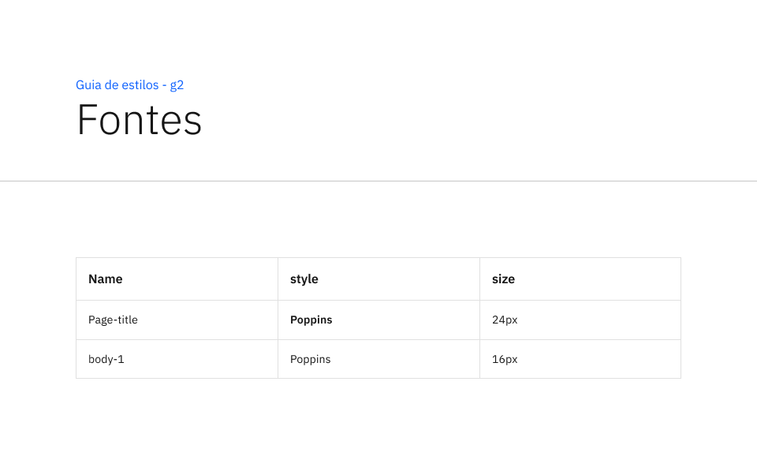

# Prototipação do Frontend

## Sumário
1. [Introdução](#1-introdução)
1. [Wireframe](#2-wireframe)
2. [Mockup](#3-mockup)
3. [Guia de Estilos](#4-guia-de-estilos)

## 1. Introdução

Com um olhar cuidadoso para a identidade e os padrões estabelecidos pela Track.Co, desenvolvemos um wireframe e um mockup detalhados para os cases de distribuição de pesquisas via WhatsApp e SMS Link. Esses designs foram projetados para alinhar-se com a estética e funcionalidade características da Track.Co, visando aprimorar a eficácia da comunicação e a experiência do usuário. 
Nosso propósito é proporcionar uma visão clara e precisa dos fluxos de interação sugeridos, estabelecendo uma fundação para o desenvolvimento da solução em foco.

## 2. Wireframe

Primeiramente, foi desenvolvido um wireframe com baixa fidelidade da solução final. Os compoonentes principais podem ser visualizados abaixo:

- **Side Bar**: Inclui o logo e a navegação principal da plataforma da Track.Co .
- **Corpo**: Área central onde estará as pesquisas que serão distribuídas. 

## 3. Mockup

Após o desenvolvimento do wireframe, partimos para uma versão mais detalhadae realista da solução proposta. Os componentes descritos anteriormente também são encontrados abaixo, mas, agora, mais fièis a realidade:

 

Para uma visualização mais detalhada, tanto do wireframe como do mockup, acesse o figma do projeto: [Figma](https://www.figma.com/file/8rsD7y4hwpuxMemicFhhGP/Grupo2M9?type=design&node-id=33%3A1694&mode=design&t=QhwJ2FDOgfJ0TQ0E-1) . Nele estão presentes todos os componentes e páginas, além de um fluxo de navegação de protótipo, que simula uma utilização real do sistema.

# 4. Guia de estilos
Anterior à fase prototipação, foi desenvolvido um guia de estilos para a solução proposta, garantindo um alto padrão de qualidade de design, e consistência de padrões e da identidade visual da plataforma.
Esse documento irá evoluir de maneira 

 
 
