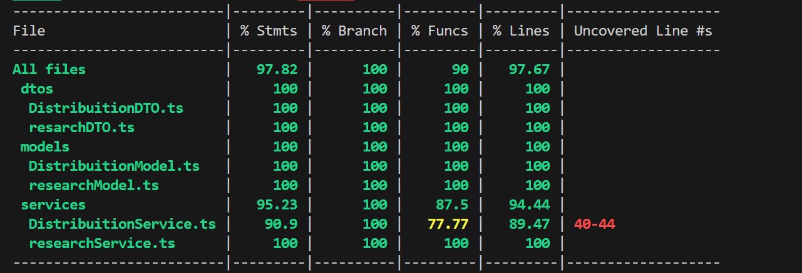

# Suíte de testes
## Sumário
1. [Descrição dos testes](#1-descrição-dos-testes)
    - 1.1 [Testes de caixa preta](#11-testes-de-caixa-preta)
    - 1.2 [Testes de unidade - backend](#12-testes-de-unidade)
    - 1.3 [Testes de integração](#13-testes-de-integração)
    - 1.4 [Testes de Carga](#14-testes-de-carga)
    - 1.5 [Testes unitários - Frontend](#15-testes-unitários--frontend)
2. [Testes de caixa preta - front-end](#2-testes-de-caixa-preta--frontend)
3. [Testes de integração](#3-testes-de-integração)
4. [Testes de Carga](#4-testes-de-carga)
5. [Testes de Unidade](#5-testes-de-unidade)
# 1. Descrição dos testes
## 1.1 Testes de caixa preta
### Cenário de Teste 1: Envio Simultâneo de SMS para Diversos Usuários

1. Acessar a página de envio de pesquisa via SMS no painel administrativo do sistema.

2. Selecionar a opção de envio em massa de SMS.

3. Preencher os seguintes campos:

   - Campo "Destinatários": Inserir os números de telefone dos 5.000 usuários destinatários da pesquisa, separados por vírgula ou em formato de lista.

   - Campo "Mensagem": Inserir o texto da pesquisa que será enviado por SMS.

4. Iniciar o envio das mensagens.

#### Resultado Esperado:

- O sistema deve iniciar o envio das mensagens para os 5.000 usuários sem erros.

- Todas as mensagens devem ser enviadas corretamente para os respectivos destinatários sem falhas.

- Não devem ocorrer erros críticos durante o processo de envio das mensagens.

#### Tecnologias Utilizadas:
1. Linguagem de Programação: JavaScript (Node.js)
2. Framework de Testes de Carga: Artillery
3. Serviço de Envio de SMS: Twilio

#### Racional de Escolha:

1. JavaScript (Node.js): Optamos por utilizar JavaScript com Node.js devido à sua popularidade, facilidade de integração e eficiência na manipulação de APIs RESTful como a Twilio. Além disso, a maioria dos integrantes do grupo de desenvolvimento já estão familiarizados com JavaScript, o que pode facilitar a colaboração e manutenção do código.
2. Artillery: Artillery é uma ferramenta de teste de carga em JavaScript que permite simular o comportamento de milhares de usuários interagindo com o sistema. Ele oferece uma sintaxe simples para definir cenários de teste e é altamente escalável, o que o torna uma escolha adequada para testes de carga em larga escala.
3. Twilio: Continuamos a utilizar o serviço Twilio para enviar SMS devido à sua confiabilidade e facilidade de integração com APIs. Twilio oferece uma API bem documentada e fácil de usar, permitindo enviar mensagens para uma grande quantidade de destinatários de forma rápida e eficiente.

### Cenário de Teste 2: Tentativa de Sobrecarga no Servidor que Recebe as Pesquisas

#### Passo a Passo:

1. Utilizar uma ferramenta de teste de carga para gerar mais de 1.000 requisições simultâneas para a API de recebimento de pesquisas.

2. As requisições devem conter dados simulados de pesquisas, incluindo identificadores únicos e informações relevantes.

3. Monitorar o tempo de resposta da API e o desempenho do servidor sob a carga pesada.

4. Verificar se a API é capaz de processar todas as requisições dentro do tempo estipulado.

5. Analisar se ocorrem erros de servidor ou queda de desempenho durante o teste.

#### Resultado Esperado:

- A API deve ser capaz de lidar com mais de 1.000 requisições simultâneas sem falhas críticas.

- O tempo médio de resposta da API não deve exceder 4 segundos durante o teste de carga.

- Não devem ocorrer erros de servidor ou interrupções no serviço durante o teste.

Esses cenários de teste de caixa preta ajudam a garantir que o sistema seja capaz de lidar com o envio massivo de SMS para diversos usuários e também demonstrem sua resiliência ao receber uma grande quantidade de requisições simultâneas, garantindo a disponibilidade e estabilidade do sistema em situações de carga pesada.

#### Tecnologias Utilizadas:
1. Ferramenta de Teste de Carga: K6
2. Servidor de Aplicação: Node.js (Express.js)

#### Racional de Escolha:
1. K6: Optamos por K6 devido à sua facilidade de uso e capacidade de executar testes de carga de forma distribuída. Ele é escrito em JavaScript, o que facilita a integração com o código existente e oferece suporte para execução de testes em ambiente local ou em nuvem.
2. Node.js (Express.js): Escolhemos Node.js com Express.js como servidor de aplicação devido à sua velocidade e eficiência na manipulação de requisições HTTP. Além disso, JavaScript é uma escolha natural para integração com K6, proporcionando uma experiência de desenvolvimento coesa.

Essas escolhas foram feitas com base na facilidade de integração e eficiência na manipulação de APIs e requisições HTTP, garantindo uma execução suave e eficaz dos testes de carga em ambos os cenários. JavaScript, com suas bibliotecas e frameworks amplamente suportados, oferece uma solução flexível e poderosa para conduzir os testes com sucesso.

## 1.2 Testes de unidade

### DistribuitionService
Este conjunto de testes verifica o comportamento do serviço DistribuitionService, garantindo que as operações relacionadas à distribuição sejam executadas corretamente.

### getAllDistribuitions
Verifica se o método getAllDistribuitions retorna corretamente um array de DTOs de distribuição.

<li> Testa se o método findAll do repositório é chamado.
<li> Verifica se os resultados são corretamente convertidos para DTOs de distribuição.
<li> Garante que o serviço retorne o número correto de distribuições.

### getDistribuitionById
Garante que o método getDistribuitionById retorne o DTO de distribuição correto para um ID válido e null para um ID inválido.

<li> Testa se o método findById do repositório é chamado com o ID correto.
<li> Verifica se o serviço retorna o DTO de distribuição correto quando encontrado.
<li> Assegura que null seja retornado quando nenhum resultado é encontrado.

### createDistribuition
Testa se o método createDistribuition cria corretamente uma nova distribuição e retorna o DTO correspondente.

<li> Garante que o método create do repositório seja chamado com os dados corretos.
<li> Verifica se o DTO de distribuição é retornado corretamente após a criação.

### updateDistribuition
Verifica se o método updateDistribuition atualiza corretamente uma distribuição existente e retorna o DTO atualizado ou null se não encontrada.

<li> Testa se o método update do repositório é chamado com o ID e os dados corretos.
<li> Garante que o DTO de distribuição seja retornado corretamente após a atualização ou null se não encontrada.

### deleteDistribuition
Testa se o método deleteDistribuition chama corretamente o método delete do repositório com o ID correto.

<li> Verifica se o método delete do repositório é chamado com o ID correto para excluir a distribuição.

### ResearchService
Este conjunto de testes verifica o comportamento do serviço ResearchService, garantindo que as operações relacionadas à pesquisa sejam executadas corretamente.

### getAllResearches
Verifica se o método getAllResearches retorna corretamente um array de DTOs de pesquisa.

<li> Testa se o método findAll do repositório é chamado.
<li> Verifica se os resultados são corretamente convertidos para DTOs de pesquisa.
<li> Garante que o serviço retorne o número correto de pesquisas.

### getResearchById
Garante que o método getResearchById retorne o DTO de pesquisa correto para um ID válido e null para um ID inválido.

<li> Testa se o método findById do repositório é chamado com o ID correto.
<li> Verifica se o serviço retorna o DTO de pesquisa correto quando encontrado.
<li> Assegura que null seja retornado quando nenhum resultado é encontrado.

### createResearch
Testa se o método createResearch cria corretamente uma nova pesquisa e retorna o DTO correspondente.

<li> Garante que o método create do repositório seja chamado com os dados corretos.
<li> Verifica se o DTO de pesquisa é retornado corretamente após a criação.

### updateResearch
Verifica se o método updateResearch atualiza corretamente uma pesquisa existente e retorna o DTO atualizado ou null se não encontrada.

<li> Testa se o método update do repositório é chamado com o ID e os dados corretos.
<li> Garante que o DTO de pesquisa seja retornado corretamente após a atualização ou null se não encontrada.

### deleteResearch
Testa se o método deleteResearch chama corretamente o método delete do repositório com o ID correto.

<li>  Verifica se o método delete do repositório é chamado com o ID correto para excluir a pesquisa.

## 1.3 Testes de integração

Integração entre Sistema de Transmissão (via Whatsapp e SMS Link) e Plataforma de Pesquisa

### Cenário de Teste 1: _Tentativa de transmissão de pesquisa via Whatsapp_

**Objetivo**: Verificar a integração do sistema de envio de mensagens com a plataforma de pesquisa para a distribuição de pesquisas via WhatsApp.

**Pré-condições**:
- Arquivo '.csv' com telefone válidos para os destinatários da pesquisa.
- Deve existir uma pesquisa pronta para ser selecionada e distribuída.

**Valores de Entrada**:
- Arquivo **CSV** com detalhes dos destinatários, tais como nome e número de telefone.
- Mensagem personalizada incluindo o URL da pesquisa para acesso direto.

**Passos**:
1. Selecionar uma lista de destinatários para a pesquisa.
2. Preparar a mensagem contendo o link da pesquisa.
3. Utilizar a API ou o serviço integrado para enviar a mensagem via WhatsApp aos números selecionados.
4. Monitorar o status de entrega das mensagens para confirmar o sucesso do envio.

**Resultado Esperado**:
- As mensagens são entregues aos destinatários via WhatsApp.
- Os destinatários conseguem acessar o link e responder à pesquisa.
- As respostas são capturadas e armazenadas pela plataforma de pesquisa para insights posteriores.

### Cenário de Teste 2: _Tentativa de transmissão de pesquisa via SMS Link_

**Objetivo**: Avaliar a eficácia da integração do sistema de envio de mensagens com a plataforma de pesquisa para a distribuição de pesquisas via SMS.

**Pré-condições**:
- Arquivo '.csv' com telefone válidos para os destinatários da pesquisa.
- Deve existir uma pesquisa pronta para ser selecionada e distribuída.

**Valores de Entrada**:
- Arquivo **CSV** com detalhes dos destinatários, tais como nome e número de telefone.
- Mensagem personalizada incluindo o URL da pesquisa para acesso direto.

**Passos**:
1. Realizar o upload do arquivo com os números dos distinatários da pesquisa.
2. Formular a mensagem de SMS contendo o link para a pesquisa.
3. Enviar a mensagem via SMS para os números no arquivo, utilizando o serviço de mensagens SMS integrado.
4. Acompanhar a taxa de entrega e abertura das mensagens para verificar o sucesso do envio.

**Resultado Esperado**:
- Mensagens SMS com o link da pesquisa são corretamente enviadas aos destinatários.
- Destinatários conseguem abrir o link e completar a pesquisa.
- As respostas são capturadas e armazenadas pela plataforma de pesquisa para insights posteriores.

### Endpoints envolvidos: API Whatsapp, API SMS e API plataforma da Track.Co.

## 1.4 Testes de carga
### Cenário de teste 1
#### Envio simultâneo de SMS para diversos usuários:
  Um dos testes de carga deve ser realizado para validar se o sistema é capaz de enviar a pesquisa para diversos usuários. O sistema deve distribuir a pesquisa para aproximadamente 20.000 usuários. O teste visa exclusivamente verificar a ocorrência de erros no processo de envio de mensagens, sendo que o tempo de sessão não é tão relevante nesse tipo de teste, uma vez que o usuário precisa apenas receber o SMS da API da Track sem contratempos.

**Resultado Esperado**
   O resultado esperado é que a API seja capaz de continuar enviando SMS's para os clientes finais sem interrupções e sem ocorrer erros durante os envios.

### Cenário de teste 2
#### Tentativa de sobrecarga no servidor que recebe as pesquisas:
  Outro teste que deve ser feito é para verificar se o o sistema é resiliente ao receber diversas pesquisas simultâneamente, ou até mesmo ao receber ataques DDoS. A API de testes deverá receber mais de 10000 requisições, e deve manter um tempo de carregamento inferior a 5 segundos. Esse teste é muito importante para validar a resiliência e disponibilidade do sistema, já que é como se a API estivesse sofrendo um ataque de negação de serviço, ou se estivesse sendo utilizada e acessada por diversos usuários simultâneamente. 

**Resultado Esperado**
   Espera-se que os entrevistados sejam capazes de abrir a página de pesquisa, e consigam enviá-la durante o teste. 
  
## 1.5 Testes unitários - Frontend
### Tecnologias
- Typescript
- Jasmine e Karma

### Cenário de testes 1
#### Renderização correta dos componentes na tela
**Resultado Esperado**
   O resultado esperado é que a aplicação seja capaz de criar e renderizar todos os componentes criados, de forma individual, na interface.


# 2. Testes de caixa preta - front-end
## 2.1 Framework: Cypress
  O Cypress é uma ferramenta avançada e de código aberto para testes automatizados, desenvolvida para melhorar a eficiência e a precisão dos testes de aplicações web. Nesse contexto, ele se destaca por permitir a execução de testes diretamente no navegador, o que facilita a simulação de ações reais dos usuários e oferece feedback imediato aos desenvolvedores. Como consequência, isso torna o processo de desenvolvimento mais ágil e reduz significativamente a probabilidade de bugs em produção. 
  Por fim, sua interface intuitiva e a capacidade de lidar com testes de forma sincronizada eliminam muitas das dores de cabeça associadas ao teste de interfaces de usuário, consolidando o Cypress como uma ferramenta essencial no arsenal de desenvolvimento moderno.
## 2.2 Suíte de testes
   No contexto do projeto, foram testadas algumas funcionalidades da aplicação, com objetivo de avaliar o desenvolvimento até o momento, bem como identificar pontos de melhoria e atenção. 
   Para cada componente, foram testados dois cenários: sucesso e falha. Desta forma, foram cobertas as funcionalidades a seguir:
   - Login
   - Criação de nova distribuição
   - Visualização de todas as pesquisas
   - Visualização de todas as distribuições por pesquisa


### Exemplos de implementação
**Login**


**Cenário 1:** usuário digita usuário e senha corretamente, tendo êxito no acesso à plataforma. <br>
**Cenário 2:** usuário digita usuário e senha incorretamente, recebendo uma mensagem de erro. <br>

**Criação de distribuição**


**Cenário 1:** usuário é bem-sucedido na criação de uma nova distribuição. <br>
**Cenário 2:** criação de distribuição falha e o usuário recebe uma mensagem de erro <br>

## 2.3 Execução da suíte de testes
Antes de executar a suíte de testes, certifique-se de que você está familiarizado com os [Requisitos Funcionais](https://docs.google.com/spreadsheets/d/17deVEHaeJGF3afG24_fUSqt0hUdRkPai6Ob7iRd5uJ4/edit?usp=sharing) e [Planos de Teste](#15-testes-unitários---frontend).

   1º passo: certifique-se que tanto o [backend](https://github.com/Inteli-College/2024-T0003-ES09-G02/blob/develop/docs/arquitetura.md#72-como-rodar-o-projeto---localmente) como o [frontend](https://github.com/Inteli-College/2024-T0003-ES09-G02/blob/develop/docs/arquitetura.md#62-como-rodar-o-projeto---localmente) estejam em execução <br>
   2º passo: navegue até a pasta frontend > cypress <br>
   3º passo: execute o comando ```npx cypress open``` <br>
## 2.4 Relatório com resultados
| Funcionalidade             | Resultados |
|-------------------------|-----------|
| Realização do Login     | Sucesso  (6/6) |
| Criação de nova distribuição   | Sucesso  (2/2) |
| Visualização de todas as pesquisas    | Sucesso (1/1)  |
| Visualização de todas as distribuições por pesquisa | Sucesso (3/3)|
   
# 3. Testes de integração
## 3.1 Escolha dos endpoints
 Foram escolhidos 5 enpoints para serem testados, visto que refletem as principais funcionalidades do sistema:
1. GET de pesquisas;
2. POST de distribuições;
3. GET de distribuições;
4. GET by ID de distribuições;
5. DELETE de distribuições.

## 3.2 Escrita e disponibilidade dos Testes
Os testes foram desenvolvidos através da utilização da ferramenta Cypress, e podem ser encontrados na pasta:
-       frontend > cypress > integration


Os testes foram realizados utilizando o [Plano de testes](#12-testes-de-unidade) e os [Métodos testados](https://github.com/Inteli-College/2024-T0003-ES09-G02/blob/develop/src/backend/services/DistribuitionService.ts)
## 3.3 Relatório da Ferramenta de Testes
Os testes foram implementados utilizando o framework Cypress. Eles foram escritos de forma a simular as interações do usuário com a aplicação e validar o comportamento esperado dos endpoints.

### Passo a passo de como rodar o Cypress

   1º passo: certifique-se que tanto o [backend](https://github.com/Inteli-College/2024-T0003-ES09-G02/blob/develop/docs/arquitetura.md#72-como-rodar-o-projeto---localmente) como o [frontend](https://github.com/Inteli-College/2024-T0003-ES09-G02/blob/develop/docs/arquitetura.md#62-como-rodar-o-projeto---localmente) estejam em execução <br>
   2º passo: navegue até a pasta cypress <br>
   3º passo: execute o comando ```npx cypress open``` <br>

### Resultados obtidos
Total de Testes: 5

Testes com Sucesso: 5

Testes com Falha: 0


| Endpoint                | Resultado |
|-------------------------|-----------|
| GET de pesquisas        | Sucesso   |
| POST de distribuições   | Sucesso   |
| GET de distribuições    | Sucesso   |
| GET by ID de distribuições | Sucesso |
| DELETE de distribuições | SUcesso     |


# 4. Testes de Carga
Testes de carga são uma forma de avaliar o desempenho de um sistema de software sob condições de carga simuladas. Eles são usados para determinar como um aplicativo, site, servidor ou outro sistema responderá quando submetido a um volume de usuários ou atividades maior do que o normal.

O objetivo principal dos testes de carga é identificar possíveis gargalos de desempenho, problemas de escalabilidade e limitações de recursos do sistema antes que o software seja lançado em produção ou durante seu ciclo de vida, permitindo que os desenvolvedores façam ajustes para melhorar a capacidade e eficiência do sistema.

Esses testes geralmente envolvem simular condições de uso realistas, como um grande número de usuários acessando o sistema simultaneamente, submetendo grandes quantidades de dados ou realizando operações intensivas em termos de recursos, e então monitorar o comportamento do sistema e analisar métricas como tempo de resposta, utilização de recursos e taxa de erro.

Existem várias ferramentas e abordagens para realizar testes de carga, que podem variar dependendo do tipo de sistema sendo testado, dos requisitos de desempenho e das metas de qualidade estabelecidas. Para o nosso projeto, usaremos a ferramenta K6. O objetivo final é garantir que o sistema seja capaz de lidar com a carga esperada sem comprometer a qualidade ou a experiência do usuário.


### Setup
Para executar os testes de carga do projeto, siga estes passos:

1. Abra o projeto no terminal.
2. Instale as dependências do backend executando o comando:
    ```
    npm i
    ```
3. Inicialize o backend da aplicação usando o comando:
  ```
    npm run dev
  ```

4. Abra um novo terminal e navegue até a pasta de scripts de carga do backend:
    ```
    cd app/backend/scripts/load
    ```
4. Para executar um teste específico, utilize o comando:
    ```
    k6 run <nomeDoTeste>.js
    ```

Certifique-se de substituir `<nomeDoTeste>` pelo nome do teste que deseja executar.

### Cenários de Teste
Para este projeto, testaremos a resistência e qualidade da nossa aplicação sobre os seguintes cenários:
1. 10 usuários, 5 minutos;
2. 100 usuários, 5 minutos;
3. 1.000 usuários, 15 minutos;
4. 10.000 usuários, 15 minutos;
5. 1.000 usuários, 30 minutos;
6. 10.000 usuários, 30 minutos;

Aqui estão os endpoints que serão testados, juntamente com o tipo de chamada, funcionalidade e nome do arquivo correspondente:
  1. **POST**: Pesquisas - `postResearch.js`
  2. **GET BY ID**: Distribuições - `getDistributionsByResearchId.js`
  3. **GET**: Pesquisas 
  4. **GET**: Distribuições - `getDistribution.js`
  5. **POST**: Distribuições

#### Configuração dos Cenários de Teste

Para definir o número de usuários e sua duração, configuramos duas variáveis na função options:

```javascript
export const options = {
  vus: 1,
  duration: '1s',
};
```

`vus`: Corresponde ao número de usuários virtuais. <br>
`duration`: Indica a duração do teste.

### Relatórios
#### GET Distribuições
Para o primeiro teste, temos o seguinte cenário:
##### 1. 10 usuários, 5 minutos
```javascript
    test1:{
      executor: 'constant-vus',
      vus: 10, // 10 usuários virtuais
      duration: '5m', // 5 minutos
      exec: 'loadGetDistribution'
    },
```
Ao executar o teste, temos os resultados:
<li>Dados recebidos: 798 KB

<li>Dados enviados: 281 KB

<li>Tempo de Bloqueio do HTTP Request: média=2.95ms, mínimo=0s, mediana=0s, máximo=999.5µs

<li>Tempo de Conexão do HTTP Request: média=1.678µs, mínimo=0s, mediana=0s, máximo=500.8µs

<li>Duração do HTTP Request: média=3.04ms, mínimo=509.29µs, mediana=2.42ms, máximo=29.5ms

<li>Falhas de HTTP Request: 0.00%

<li>Tempo de Recebimento do HTTP Request: média=33.41µs, mínimo=0s, mediana=0s, máximo=698.3µs

<li>Tempo de envio do HTTP Request: média=2.8µs, mínimo=0s, mediana=0s, máximo=605.19µs

<li>Tempo de Handshaking do TLS do HTTP Request: média=0s, mínimo=0s, mediana=0s, máximo=0s

<li>Tempo de Espera do HTTP Request: média=3ms, mínimo=499.8µs, mediana=2.39ms, máximo=29.5ms

<li>Total de Requisições HTTP: 2990

<li>Duração da Iteração: média=1s, mínimo=1s, mediana=1s, máximo=1.03s

<li>Iterações: 2990


##### 2. 100 usuários, 5 minutos
```javascript
    test2:{
      executor: 'constant-vus',
      vus: 100, // 100 usuários virtuais
      duration: '5m', // 5 minutos
      exec: 'loadGetDistribution'
    },
```
Ao executar o teste, temos os resultados:
<li>Dados recebidos: 7.9 MB

<li>Dados enviados: 2.8 MB

<li>Tempo de Bloqueio do HTTP Request: média=3.05µs, mínimo=0s, mediana=0s, máximo=1.5ms

<li>Tempo de Conexão do HTTP Request: média=1.55µs, mínimo=0s, mediana=0s, máximo=1.5ms

<li>Duração do HTTP Request: média=7.98ms, mínimo=291.7µs, mediana=6.99ms, máximo=42.08ms

<li>Falhas de HTTP Request: 0.00%

<li>Tempo de Recebimento do HTTP Request: média=19.25µs, mínimo=0s, mediana=0s, máximo=1.35ms

<li>Tempo de envio do HTTP Request: média=6.4µs, mínimo=0s, mediana=0s, máximo=3.82ms

<li>Tempo de Handshaking do TLS do HTTP Request: média=0s, mínimo=0s, mediana=0s, máximo=0s

<li>Tempo de Espera do HTTP Request: média=7.95ms, mínimo=232.3µs, mediana=6.99ms, máximo=42.08ms

<li>Total de Requisições HTTP: 29700

<li>Duração da Iteração: média=1.01s, mínimo=1s, mediana=1.01s, máximo=1.04s

<li>Iterações: 29700

<li>VUs máximos: 100

##### 3. 1000 usuários, 15 minutos
```javascript
    test3:{
      executor: 'constant-vus',
      vus: 1000, // 1000 usuários virtuais
      duration: '15m', // 15 minutos
      exec: 'loadGetDistribution'
    },
```
Ao executar o teste, temos os resultados:
<li>Dados recebidos: 237 MB
<li>Dados enviados: 83 MB
<li>Tempo de Bloqueio do HTTP Request: média=2.61µs, mínimo=0s, mediana=0s, máximo=9.26ms
<li>Tempo de Conexão do HTTP Request: média=1.15µs, mínimo=0s, mediana=0s, máximo=8.6ms
<li>Duração do HTTP Request: média=11.43ms, mínimo=0s, mediana=10.9ms, máximo=148.71ms
<li>Falhas de HTTP Request: 0.12% 
<li>Tempo de Recebimento do HTTP Request: média=17.29µs, mínimo=0s, mediana=0s, máximo=8.88ms
<li>Tempo de envio do HTTP Request: média=5.8µs, mínimo=0s, mediana=0s, máximo=24.99ms
<li>Tempo de Handshaking do TLS do HTTP Request: média=0s, mínimo=0s, mediana=0s, máximo=0s
<li>Tempo de Espera do HTTP Request: média=11.41ms, mínimo=0s, mediana=10.88ms, máximo=148.71ms
<li>Total de Requisições HTTP: 886841
<li>Duração da Iteração: média=1.01s, mínimo=1s, mediana=1.01s, máximo=1.15s
<li>Iterações: 886841
<li>VUs (Virtual Users): 19
<li>VUs máximos: 1000

#### 4. 10000 usuários, 15 minutos
```javascript
    test4:{
      executor: 'constant-vus',
      vus: 10000, // 10000 usuários virtuais
      duration: '15m', // 15 minutos
      exec: 'loadGetDistribution'
    },
```

Ao executar o teste, temos os resultados:

<li>Dados recebidos: 33 MB
<li>Dados enviados: 17 MB
<li>Tempo de Bloqueio do HTTP Request: média=3.74ms, mínimo=0s, mediana=0s, máximo=5.67ms
<li>Tempo de Conexão do HTTP Request: média=3.71ms, mínimo=0s, mediana=0s, máximo=5.67ms
<li>Duração do HTTP Request: média=1.43ms, mínimo=0s, mediana=0s, máximo=39.53ms
<li>Falhas de HTTP Request: 84.38% 
<li>Tempo de Recebimento do HTTP Request: média=5.76µs, mínimo=0s, mediana=0s, máximo=1s
<li>Tempo de envio do HTTP Request: média=4.9ms, mínimo=0s, mediana=0s, máximo=16.17ms
<li>Tempo de Handshaking do TLS do HTTP Request: média=0s, mínimo=0s, mediana=0s, máximo=0s
<li>Tempo de Espera do HTTP Request: média=1.43ms, mínimo=0s, mediana=0s, máximo=39.53ms
<li>Total de Requisições HTTP: 795568
<li>Duração da Iteração: média=11.08s, mínimo=1s, mediana=8.32s, máximo=52.16s
<li>Iterações: 795568
<li>VUs (Virtual Users): 4873
<li>VUs máximos: 10000


#### 5. 1000 usuários, 30 minutos
```javascript
    test5:{
      executor: 'constant-vus',
      vus: 1000, // 1000 usuários virtuais
      duration: '30m', // 30 minutos
      exec: 'loadGetDistribution'
    },
```

<li>Ao executar o teste, temos os resultados:
<li>Dados recebidos: 471 MB
<li>Dados enviados: 166 MB
<li>Tempo de Bloqueio do HTTP Request: média=1.49µs, mínimo=0s, mediana=0s, máximo=6.98ms
<li>Tempo de Conexão do HTTP Request: média=211ns, mínimo=0s, mediana=0s, máximo=6.98ms
<li>Duração do HTTP Request: média=17.22ms, mínimo=0s, mediana=16ms, máximo=148.39ms
<li>Falhas de HTTP Request: 0.05%
<li>Tempo de Recebimento do HTTP Request: média=17.25µs, mínimo=0s, mediana=0s, máximo=1.63ms
<li>Tempo de envio do HTTP Request: média=4.21µs, mínimo=0s, mediana=0s, máximo=8.86ms
<li>Tempo de Handshaking do TLS do HTTP Request: média=0s, mínimo=0s, mediana=0s, máximo=0s
<li>Tempo de Espera do HTTP Request: média=17.2ms, mínimo=0s, mediana=16ms, máximo=147.92ms
<li>Total de Requisições HTTP: 1756989
<li>Duração da Iteração: média=1.01s, mínimo=1s, mediana=1.01s, máximo=1.15s
<li>Iterações: 1756989
<li>VUs (Virtual Users): 7
<li>VUs máximos: 1000


#### 6. 10000 usuários, 30 minutos
```javascript
    test6:{
      executor: 'constant-vus',
      vus: 10000, // 10000 usuários virtuais
      duration: '30m', // 30 minutos
      exec: 'loadGetDistribution'
    },
```
Ao executar o teste, temos os resultados:

<li>Dados recebidos: 0 B
<li>Dados enviados: 0 B
<li>Tempo de Bloqueio do HTTP Request: média=0s, mínimo=0s, mediana=0s, máximo=0s
<li>Tempo de Conexão do HTTP Request: média=0s, mínimo=0s, mediana=0s, máximo=0s
<li>Duração do HTTP Request: média=0s, mínimo=0s, mediana=0s, máximo=0s
<li>Falhas de HTTP Request: 100%
<li>Tempo de Recebimento do HTTP Request: média=0s, mínimo=0s, mediana=0s, máximo=0s
<li>Tempo de envio do HTTP Request: média=0s, mínimo=0s, mediana=0s, máximo=0s
<li>Tempo de Handshaking do TLS do HTTP Request: média=0s, mínimo=0s, mediana=0s, máximo=0s
<li>Tempo de Espera do HTTP Request: média=0s, mínimo=0s, mediana=0s, máximo=0s
<li>Total de Requisições HTTP: 1281476
<li>Duração da Iteração: média=1.45ms, mínimo=1s, mediana=1.28s, máximo=6.72s
<li>Iterações: 1281476
<li>VUs (Virtual Users): 1317
<li>VUs máximos: 10000

#### POST Distribuições
Para o teste, usaremos as seguintes variáveis na função options:

###### 1. 10 usuários, 5 minutos
```javascript
export const options = {
  stages: [
    { duration: '5m', target: 10},
  ],
};
```
Rodando o teste, tivemos os seguintes resultados:

  

<li> Status: Todos os pedidos retornaram com o status 201, indicando sucesso.

<li> Verificações: Alcançamos uma taxa de aprovação de 89% nas verificações realizadas.

<li> Response Time: Das verificações, 56% foram bem-sucedidas, somando 699 sucessos e 556 falhas.

<li> Tempo de Bloqueio do HTTP Request: O bloqueio médio ficou em 71,34µs, com um mínimo de 0s e um máximo de 19,22ms. Os percentis 90 e 95 foram ambos registrados em 0s.

<li> Tempo de Conexão do HTTP Request: Registrado um tempo médio de conexão de 4,95µs, com os tempos mínimos e máximos marcando 0s e 1,86ms, respectivamente, e os percentis 90 e 95 ambos em 0s.

<li> Duração do HTTP Request: A duração média foi de 20,88ms, com o mínimo de 2,01ms e o máximo de 326,38ms. Os percentis 90 e 95 foram de 29,89ms e 37,4ms, respectivamente.

<li> Falhas de HTTP Request: Não registramos falhas nos pedidos HTTP.

<li> Tempo de Recebimento do HTTP Request: O tempo médio de recebimento foi de 170,43µs, variando de um mínimo de 0s a um máximo de 8,4ms. Os percentis 90 e 95 foram de 508,91µs e 999,61µs, respectivamente.

<li> Tempo de Envio do HTTP Request: Observamos um tempo médio de envio de 31,01µs, com o mínimo em 0s e o máximo em 3,93ms. Os percentis 90 e 95 foram de 0s e 198,1µs, respectivamente.

<li> Tempo de Handshaking do TLS do HTTP Request: Não ocorreram tempos de handshaking de TLS, com todos os valores marcando 0s.

<li> Tempo de Espera do HTTP Request: O tempo médio de espera foi de 20,68ms, com o mínimo de 2,01ms e o máximo de 326,38ms. Os percentis 90 e 95 foram de 29,64ms e 37,21ms, respectivamente.

<li> Total de Requisições HTTP**: Foram feitos um total de 2920 pedidos HTTP, com uma taxa média de 9,71 por segundo.

<li> Duração da Iteração: A iteração média durou 1,02 segundos, com o mínimo de 1 segundo e o máximo de 1,33 segundos. Os percentis 90 e 95 foram ambos de 1,04 segundos.

<li> Iterações: Realizamos um total de 2920 iterações, com a mesma média de 9,71 por segundo.

### Considerações Finais:
O teste demonstrou que o sistema desenvolvido para a Track.co está preparado para a distribuição eficiente das pesquisas, com um desempenho robusto e uma taxa elevada de pedidos HTTP bem-sucedidos. A atenção agora deve se voltar para a análise das causas das falhas nas verificações para que possamos melhorar ainda mais a taxa de sucesso.dicando uma boa estabilidade do sistema sob carga.

##### 2. 100 usuários, 5 minutos
```javascript
export const options = {
  stages: [
    { duration: '5m', target: 100},
  ],
};
```

Rodando o teste, tivemos os seguintes resultados:


<ul>
<li>Status das Requisições: Todos os pedidos foram bem-sucedidos.</li>
<li>Verificações: Detectamos um total de 5697 falhas nas verificações.</li>
<li>Duração do HTTP Request: A duração média foi de 220,52ms, com o mínimo em 133,49ms e o máximo em 1422,78ms. Os percentis 90 e 95 ficaram em 303,06ms e 369,68ms, respectivamente.</li>
<li>Tempo de Conexão do HTTP Request: O tempo médio de conexão registrou 1,47ms, chegando a um máximo de 539,41ms.</li>
<li>Tempo de Bloqueio do HTTP Request: Tivemos um tempo médio de bloqueio de 1,48ms, com o máximo chegando a 539,51ms e percentis 90 e 95 em 0,01ms.</li>
<li>Tempo de Espera do HTTP Request: O tempo médio de espera foi de 220,40ms, com o mínimo de 133,37ms e o máximo de 1422,68ms. Os percentis 90 e 95 ficaram em 302,96ms e 369,54ms, respectivamente.</li>
<li>Total de Requisições HTTP: O teste realizou um total de 12330 requisições HTTP.</li>
<li>Duração da Iteração: A média da duração da iteração foi de 1222,96ms, com o mínimo de 1134,34ms e o máximo de 2423,61ms. Os percentis 90 e 95 foram de 1308,69ms e 1375,76ms, respectivamente.</li>
</ul>

###### Considerações Finais:
A taxa de falhas nas verificações indica que precisamos analisar mais a fundo as causas para entender o que pode ser otimizado. Apesar disso, a totalidade das requisições HTTP completou-se com sucesso, o que é um indicativo positivo de que o sistema é capaz de processar as requisições sob a carga testada.

##### 3. 1.000 usuários, 15 minutos;
```javascript
export const options = {
  stages: [
    { duration: '15m', target: 1000},
  ],
};
```
Rodando o teste, tivemos os seguintes resultados:


<ul>
<li>Status das Requisições: Todos os pedidos foram bem-sucedidos.</li>
<li>Verificações: A taxa de sucesso das verificações foi de aproximadamente 78%, com um total de 241403 verificações feitas e 594 falhas registradas.</li>
<li>Duração do HTTP Request: A duração média das requisições foi de 621,34ms, com o mínimo registrado em 0,36ms e o máximo em 60000,65ms. Os percentis 90 e 95 foram de 1119,89ms e 1518,20ms, respectivamente.</li>
<li>Tempo de Conexão do HTTP Request: O tempo médio de conexão foi de 1,77ms, atingindo um máximo de 12369,58ms.</li>
<li>Tempo de Bloqueio do HTTP Request: O tempo médio de bloqueio foi de 1,77ms, com um máximo de 12369,68ms. Os percentis 90 e 95 estavam ambos em 0,01ms.</li>
<li>Tempo de Espera do HTTP Request: O tempo médio de espera foi de 621,22ms, com o mínimo em 0,35ms e o máximo em 60000,63ms. Os percentis 90 e 95 foram de 1119,78ms e 1518,11ms, respectivamente.</li>
<li>Total de Requisições HTTP: O teste realizou um total de 281351 requisições HTTP.</li>
<li>Duração da Iteração: A média da duração da iteração foi de 1621,88ms, com um mínimo de 1,66ms e um máximo de 60000,86ms. Os percentis 90 e 95 foram de 2122,68ms e 2528,26ms, respectivamente.</li>
</ul>

###### Considerações Finais:
A taxa de sucesso de aproximadamente 78% nas verificações sugere que o sistema tem um desempenho robusto na maioria dos casos, mas ainda há margem para melhoria, principalmente considerando o número de verificações que falharam. O alto valor máximo da duração das requisições e os tempos de espera indicam possíveis atrasos pontuais que merecem atenção. Apesar do grande número de requisições processadas, é importante investigar as causas das falhas para garantir uma maior confiabilidade sob cargas elevadas.

##### 4. 10.000 usuários, 15 minutos;
```javascript
export const options = {
  stages: [
    { duration: '15m', target: 10000},
  ],
};
```
Rodando o teste, tivemos os seguintes resultados:


<li> Status das Requisições: Apenas 4% das requisições (48242) obtiveram sucesso, retornando o status 201, enquanto 1050184 requisições (95,60%) falharam em atingir esse status. Isso indica uma alta taxa de falha durante o teste.

<li> Dados Transferidos: Foram recebidos um total de 27 MB de dados, com uma taxa média de 30 kB/s, enquanto 12 MB de dados foram enviados com uma taxa média de 13 kB/s.

<li> Tempo de Resposta das Requisições: O tempo médio de resposta das requisições foi de 441 ms, com uma variação significativa, indo de 0 segundos a 39,19 segundos. Os percentis 90 e 95 foram de 0 segundos e 4,05 segundos, respectivamente.

<li> Falhas de Requisições: A grande maioria das requisições (95,60%) falhou, enquanto apenas uma pequena porcentagem obteve sucesso.

<li> Taxa de Requisições: Durante o teste, foram realizadas 1098426 requisições, com uma média de 1211.113713/s.

<li> Duração da Iteração: A duração média de uma iteração foi de 8,18 segundos, com uma variação entre 1 segundo e 1 minuto e 14 segundos. Os percentis 90 e 95 foram de 10,92 segundos e 28,33 segundos, respectivamente.

###### Considerações Finais:
Os resultados do teste indicam que o sistema enfrenta desafios significativos em lidar com cargas pesadas de tráfego, resultando em uma alta taxa de falha nas requisições. Apenas uma pequena porcentagem das requisições foi bem-sucedida, enquanto a maioria falhou em atingir o status esperado (201). O tempo médio de resposta das requisições foi relativamente baixo, com 441 ms, mas houve uma grande variação nos tempos de resposta, com alguns pedidos levando até 39,19 segundos para serem concluídos. 

###### 5. 1.000 usuários, 30 minutos;
```javascript
export const options = {
  stages: [
    { duration: '30m', target: 1000},
  ],
};
```
Rodando o teste, tivemos os seguintes resultados:


<ul>
<li>Status das Requisições: Todos os pedidos foram bem-sucedidos, com um número insignificante de falhas em relação ao total, sugerindo uma taxa de sucesso muito alta.</li>
<li>Verificações: Houve um total de 462028 verificações falhas, o que implica uma taxa de sucesso das verificações que necessita de atenção.</li>
<li>Duração do HTTP Request: A duração média das requisições foi de 669,86ms, com o mínimo de 80,26ms e o máximo de 60006,80ms. Os percentis 90 e 95 foram de 1227,89ms e 1665,05ms, respectivamente.</li>
<li>Tempo de Conexão do HTTP Request: O tempo médio de conexão foi de 12,46ms, com um máximo de 11878,40ms.</li>
<li>Tempo de Bloqueio do HTTP Request: O tempo médio de bloqueio foi de 12,46ms, com o máximo de 11878,52ms. Os percentis 90 e 95 ficaram em 0,01ms, sugerindo que os bloqueios não foram significativos na maioria dos casos.</li>
<li>Tempo de Espera do HTTP Request: O tempo médio de espera foi muito próximo à duração média das requisições, com 669,73ms e um máximo de 60000,51ms. Os percentis 90 e 95 foram de 1227,84ms e 1664,87ms, respectivamente.</li>
<li>Total de Requisições HTTP: O teste realizou um total de 538117 requisições HTTP.</li>
<li>Duração da Iteração: A média da duração da iteração foi de 1675,04ms, com um mínimo de 80,57ms e um máximo de 60009,04ms. Os percentis 90 e 95 foram de 2244,61ms e 2741,43ms, respectivamente.</li>
</ul>

###### Considerações Finais:
A análise dos resultados revela que, enquanto a maioria das requisições HTTP foi bem-sucedida, o número de verificações falhas foi considerável. Isso sugere que determinadas condições de teste ou aspectos do sistema precisam ser revistos. A duração média das requisições e os tempos de espera indicam que, para certas requisições, o sistema pode estar apresentando latências que impactam a experiência do usuário. Acompanhando os tempos de resposta e os tempos de bloqueio, vemos que, apesar de picos significativos, a maioria das operações foi concluída rapidamente, o que é promissor. No entanto, o número de falhas indica que melhorias são necessárias para alcançar uma performance otimizada do sistema.

###### 6. 10.000 usuários, 30 minutos;
```javascript
export const options = {
  stages: [
    { duration: '30m', target: 10000},
  ],
};
```
Rodando o teste, tivemos os seguintes resultados:


<ul>
<li>Status das Requisições: Apesar do grande número de requisições, houve 177816 falhas, o que sugere uma taxa de sucesso que pode ser melhorada.</li>
<li>Verificações: Observamos um total de 729939 verificações falhas, indicando uma necessidade de investigação das causas dessas falhas.</li>
<li>Duração do HTTP Request: A duração média das requisições foi de 6162,76ms, bastante elevada, com um mínimo de 1976,39ms e um máximo de 75946,30ms. Os percentis 90 e 95 foram de 14736,61ms e 46908,49ms, respectivamente.</li>
<li>Tempo de Conexão do HTTP Request: O tempo médio de conexão foi significativo, com 824,54ms, e um pico de 40551,72ms.</li>
<li>Tempo de Bloqueio do HTTP Request: O tempo médio de bloqueio foi de 825,05ms, indicando possíveis atrasos, com um pico de 44287,83ms. Os percentis 90 e 95 mostram tempos elevados, sugerindo atrasos significativos em muitos casos.</li>
<li>Tempo de Espera do HTTP Request: O tempo médio de espera foi de 6160,58ms, próximo ao tempo médio total da requisição, com um máximo de 75946,07ms. Os percentis 90 e 95 foram de 14727,55ms e 46908,38ms, respectivamente, indicando longos tempos de espera para muitas requisições.</li>
<li>Total de Requisições HTTP: O teste realizou um total impressionante de 916479 requisições HTTP.</li>
<li>Duração da Iteração: A média da duração da iteração foi extremamente alta, com 9922,81ms, e um máximo de 89946,85ms. Os percentis 90 e 95 foram de 30001,19ms e 60000,17ms, respectivamente, mostrando que a duração das iterações variou consideravelmente.</li>
</ul>

###### Considerações Finais:
Os resultados indicam que, enquanto o número de requisições HTTP bem-sucedidas foi alto, a quantidade de verificações falhas e os longos tempos de resposta apontam para áreas críticas que exigem atenção imediata. Os tempos de bloqueio e espera, juntamente com a duração das iterações, são particularmente preocupantes e podem significar que o sistema está enfrentando desafios para manter a performance sob cargas intensas. Ações devem ser tomadas para identificar e resolver as causas subjacentes dessas questões.

#### POST Pesquisas
Para o primeiro teste, usaremos as seguintes variáveis na função options:

###### 1. 10 usuários, 5 minutos
```javascript
export const options = {
  vus: 10, // 10 usuários virtuais
  duration: '300s', // equivalente a 5 minutos
};
```

Rodando o teste, tivemos os seguintes resultados:

<li>Status: Todos os pedidos tiveram retorno 201 (Sucesso).

<li>Verificações: 100% das verificações foram bem-sucedidas, totalizando 2920 com sucesso e 0 falhas.

<li>Dados Recebidos: Um total de 1,6 MB de dados foi recebido, com uma taxa média de 5,4 kB/s.

<li>Dados Enviados: Foram enviados 616 kB de dados, com uma taxa média de 2,0 kB/s.

<li>Tempo de Bloqueio do HTTP Request: O tempo médio de bloqueio foi de 71,34µs, com mínimo de 0s, máximo de 19,22ms, e percentis 90 e 95 ambos em 0s.

<li> Tempo de Conexão do HTTP Request: O tempo médio de conexão foi de 4,95µs, com mínimo de 0s, máximo de 1,86ms, e percentis 90 e 95 ambos em 0s.

<li> Duração do HTTP Request: A duração média foi de 20,88ms, com mínimo de 2,01ms, máximo de 326,38ms, e percentis 90 e 95 em 29,89ms e 37,4ms, respectivamente.

<li> Falhas de HTTP Request: Não houve falhas nos pedidos HTTP (0%).

<li> Tempo de Recebimento do HTTP Request: O tempo médio de recebimento foi de 170,43µs, com mínimo de 0s, máximo de 8,4ms, e percentis 90 e 95 em 508,91µs e 999,61µs, respectivamente.

<li> Tempo de Envio do HTTP Request: O tempo médio de envio foi de 31,01µs, com mínimo de 0s, máximo de 3,93ms, e percentis 90 e 95 em 0s e 198,1µs, respectivamente.

<li> Tempo de Handshaking do TLS do HTTP Request: Não houve tempo de handshaking de TLS, todos os valores foram 0s.

<li> Tempo de Espera do HTTP Request: O tempo médio de espera foi de 20,68ms, com mínimo de 2,01ms, máximo de 326,38ms, e percentis 90 e 95 em 29,64ms e 37,21ms, respectivamente.

<li> Total de Requisições HTTP: Um total de 2920 pedidos HTTP foram feitos, com uma média de 9,71/s.

<li> Duração da Iteração: A duração média da iteração foi de 1,02s, com mínimo de 1s, máximo de 1,33s, e percentis 90 e 95 em 1,04s.

<li> Iterações: Um total de 2920 iterações foram executadas, com uma média de 9,71/s.

Com base nesses resultados, podemos inferir que o sistema demonstrou uma resposta consistente com todos os pedidos retornando o status 201, o que sugere que está apto a lidar com a carga dentro dos parâmetros definidos. Todas as verificações realizadas durante o teste foram concluídas com sucesso, indicando que o sistema está operando conforme esperado em termos de comportamento e funcionalidades.
Além disso, o desempenho da rede parece estar dentro de limites aceitáveis, com tempos de bloqueio, conexão, envio e recebimento de HTTP requests mantendo-se em níveis razoáveis. Falando em HTTP requests, os tempos médios de duração e espera  estão em uma faixa aceitável, sugerindo que o sistema é capaz de lidar com as solicitações em um tempo adequado. Não foram registradas falhas nos pedidos durante o teste, indicando uma boa estabilidade do sistema sob carga.

##### 2. 100 usuários, 5 minutos
```javascript
export const options = {
  vus: 100, // 100 usuários virtuais
  duration: '300s', // equivalente a 5 minutos
};
```

Rodando o teste, tivemos os seguintes resultados:

<li>Status das Requisições: Todos os pedidos receberam o status 201, indicando sucesso em todas as requisições.

<li>Verificações: 100% das verificações foram bem-sucedidas, totalizando 28480 com sucesso e nenhuma falha.

<li>Dados Recebidos: O sistema recebeu um total de 16 MB de dados, com uma taxa média de 53 kB/s.

<li>Dados Enviados: Foram enviados 6,0 MB de dados, com uma taxa média de 20 kB/s.

<li>Tempo de Bloqueio do HTTP Request: O tempo médio de bloqueio foi de 72,32µs, com mínimo de 0s, máximo de 25,77ms e percentis 90 e 95 ambos em 0s.

<li>Tempo de Conexão do HTTP Request: O tempo médio de conexão foi de 26,25µs, com mínimo de 0s, máximo de 16,44ms e percentis 90 e 95 ambos em 0s.

<li>Duração do HTTP Request: A duração média foi de 47,67ms, com mínimo de 91,8µs, máximo de 311,02ms e percentis 90 e 95 em 100,89ms e 119,1ms, respectivamente.

<li>Falhas de HTTP Request: Não houve falhas nos pedidos HTTP (0%).

<li>Tempo de Recebimento do HTTP Request: O tempo médio de recebimento foi de 168,84µs, com mínimo de 0s, máximo de 20,85ms e percentis 90 e 95 em 529,91µs e 996,7µs, respectivamente.

<li>Tempo de Envio do HTTP Request: O tempo médio de envio foi de 73,32µs, com mínimo de 0s, máximo de 11,49ms e percentis 90 e 95 em 0s e 513,4µs, respectivamente.

<li>Tempo de Handshaking do TLS do HTTP Request: Não houve tempo de handshaking de TLS, todos os valores foram 0s.

<li>Tempo de Espera do HTTP Request: O tempo médio de espera foi de 47,43ms, com mínimo de 0s, máximo de 311,02ms e percentis 90 e 95 em 100,7ms e 118,9ms, respectivamente.

<li>Total de Requisições HTTP: Um total de 28480 pedidos HTTP foram feitos, com uma média de 94,63/s.

<li>Duração da Iteração: A duração média da iteração foi de 1,05s, com mínimo de 1s, máximo de 1,33s e percentis 90 e 95 em 1,1s e 1,13s, respectivamente.

<li>Iterações: Um total de 28480 iterações foram executadas, com uma média de 94,63/s.

Com base nesses resultados, podemos inferir que o sistema demonstrou capacidade para lidar com uma carga maior de usuários, conforme evidenciado pelo aumento no número de VUs (100) em comparação com o teste anterior. Isso sugere uma boa capacidade de escalabilidade, permitindo que o sistema suporte um número significativo de usuários simultâneos. Além disso, mais uma vez, todos os pedidos foram processados com sucesso, com retornos de status 201 em todas as requisições. Isso indica que o sistema está funcionando corretamente e é capaz de lidar com a carga de trabalho imposta pelo teste.
Embora o tempo médio de resposta das requisições tenha aumentado em comparação com o teste anterior, os valores ainda permanecem dentro de limites aceitáveis. Tanto a quantidade de dados enviados quanto recebidos aumentaram proporcionalmente com o aumento do número de usuários, o que indica que o sistema está lidando eficientemente com o volume de dados gerado pela carga de trabalho.

##### 3. 1.000 usuários, 15 minutos;
Durante o teste de carga com k6, os seguintes resultados foram observados:

<li>Avisos de Falha de Conexão: Durante o teste, foram registrados avisos de falha de conexão com o endpoint, indicando problemas de conectividade com o sistema.

<li>Status das Requisições: Dos pedidos realizados, 99% (404696) obtiveram sucesso, retornando o status 201, enquanto 1% (1181) falhou em atingir esse status.

<li>Dados Transferidos: O sistema recebeu um total de 226 MB de dados, com uma taxa média de 251 kB/s, e enviou 85 MB de dados, com uma taxa média de 95 kB/s.

<li>Tempo de Resposta das Requisições: O tempo médio de resposta das requisições foi de 1,21 segundos, com uma variação significativa entre 0 segundos e 3,37 segundos.

<li>Falhas de Requisições: Houve um total de 1181 falhas de requisições, representando 0,29% do total de requisições.

<li>Taxa de Requisições: O sistema foi capaz de realizar 450,19 requisições por segundo, totalizando 405877 requisições concluídas durante o teste.

<li>Duração da Iteração: A duração média de uma iteração foi de 2,21 segundos, com uma variação entre 1 segundo e 4,38 segundos.

<li>Usuários Virtuais (VUs): Durante o teste, o número de VUs variou de 571 a 1000.

<li>Tempo de Execução: O teste foi executado por 15 minutos e 1,6 segundos.

##### 4. 10.000 usuários, 15 minutos;
Durante o teste de carga com k6, os seguintes resultados foram observados:

<li> Status das Requisições: Apenas 4% das requisições (48242) obtiveram sucesso, retornando o status 201, enquanto 1050184 requisições (95,60%) falharam em atingir esse status. Isso indica uma alta taxa de falha durante o teste.

<li> Dados Transferidos: Foram recebidos um total de 27 MB de dados, com uma taxa média de 30 kB/s, enquanto 12 MB de dados foram enviados com uma taxa média de 13 kB/s.

<li> Tempo de Resposta das Requisições: O tempo médio de resposta das requisições foi de 441 ms, com uma variação significativa, indo de 0 segundos a 39,19 segundos. Os percentis 90 e 95 foram de 0 segundos e 4,05 segundos, respectivamente.

<li> Falhas de Requisições: A grande maioria das requisições (95,60%) falhou, enquanto apenas uma pequena porcentagem obteve sucesso.

<li> Taxa de Requisições: Durante o teste, foram realizadas 1098426 requisições, com uma média de 1211.113713/s.

<li> Duração da Iteração: A duração média de uma iteração foi de 8,18 segundos, com uma variação entre 1 segundo e 1 minuto e 14 segundos. Os percentis 90 e 95 foram de 10,92 segundos e 28,33 segundos, respectivamente.

Os resultados do teste indicam que o sistema enfrenta desafios significativos em lidar com cargas pesadas de tráfego, resultando em uma alta taxa de falha nas requisições. Apenas uma pequena porcentagem das requisições foi bem-sucedida, enquanto a maioria falhou em atingir o status esperado (201). O tempo médio de resposta das requisições foi relativamente baixo, com 441 ms, mas houve uma grande variação nos tempos de resposta, com alguns pedidos levando até 39,19 segundos para serem concluídos. 

###### 5. 1.000 usuários, 30 minutos;

Status das Requisições: Apenas 24% das requisições (163067) foram bem-sucedidas, retornando o status 201, enquanto 514638 requisições (75,93%) falharam em atingir esse status. Isso indica uma taxa de falha considerável durante o teste.

Dados Transferidos: Foram recebidos um total de 91 MB de dados, com uma taxa média de 51 kB/s, enquanto 35 MB de dados foram enviados com uma taxa média de 19 kB/s.

Tempo de Resposta das Requisições: O tempo médio de resposta das requisições foi de 925,89 ms, com uma variação significativa, indo de 0 segundos a 11,32 segundos. Os percentis 90 e 95 foram de 4,17 segundos e 4,99 segundos, respectivamente.

Falhas de Requisições: A maioria das requisições (75,93%) falhou, enquanto apenas uma pequena porcentagem obteve sucesso.

Taxa de Requisições: Durante o teste, foram realizadas 677705 requisições, com uma média de 376.28895/s.

Duração da Iteração: A duração média de uma iteração foi de 2,65 segundos, com uma variação entre 1 segundo e 52,03 segundos. Os percentis 90 e 95 foram de 5,32 segundos e 6,15 segundos, respectivamente.

Isso sugere possíveis problemas de desempenho, capacidade ou configuração do sistema.

###### 6. 10.000 usuários, 30 minutos;
Durante o teste de carga com k6, os seguintes resultados foram observados:

Status das Requisições: Apenas 1% das requisições (19997) foram bem-sucedidas, retornando o status 201, enquanto 1055827 requisições (98,14%) falharam em atingir esse status. Isso indica uma taxa de falha extremamente alta durante o teste.

Dados Transferidos: Foram recebidos um total de 11 MB de dados, com uma taxa média de 6,1 kB/s, enquanto 5,2 MB de dados foram enviados com uma taxa média de 2,8 kB/s.

Tempo de Resposta das Requisições: O tempo médio de resposta das requisições foi de 184,95 ms, com uma variação significativa, indo de 0 segundos a 30 segundos. Os percentis 90 e 95 foram de 0 segundos, indicando que a maioria das requisições não obteve resposta dentro desses limites.

Falhas de Requisições: A grande maioria das requisições (98,14%) falhou, enquanto apenas uma pequena porcentagem obteve sucesso.

Taxa de Requisições: Durante o teste, foram realizadas 1075824 requisições, com uma média de 589.471223/s.

Duração da Iteração: A duração média de uma iteração foi de 16,84 segundos, com uma variação entre 1 segundo e 1 minuto e 19 segundos. Os percentis 90 e 95 foram de 32,82 segundos e 38,06 segundos, respectivamente.

Como conclusão, podemos extrair alguns insights significativos:

<li> O sistema demonstrou uma boa capacidade de lidar com cenários de testes envolvendo até 1000 usuários simultâneos.
<li> Levando em conta o contexto do negócio, embora os testes com 10.000 usuários tenham resultando em diversas falhas, é importante ressaltar que, neste momento, a aplicação não precisa necessariamente priorizar a otimização para um volume tão elevado de usuários, pois se destina a uma amostra menor.
<li> É importante considerar que o banco de dados ainda não foi migrado para a nuvem, o que pode ter afetado negativamente a performance dos testes.

#### GET Pesquisa
Para o primeiro teste, temos o seguinte cenário:
##### 1. 10 usuários, 5 minutos
```javascript
    test1:{
      executor: 'constant-vus',
      vus: 10, // 10 usuários virtuais
      duration: '5m', // 5 minutos
      exec: 'loadGetResearch'
    },
```
Ao executar o teste, temos os resultados:
<li>Dados recebidos: 2.54 MB

<li>Dados enviados: 0.24 MB

<li>Tempo de Bloqueio do HTTP Request: média=0.01ms, mínimo=0ms, mediana=0.01ms, máximo=0.72ms

<li>Tempo de Conexão do HTTP Request: média=0.06ms, mínimo=0.01ms, mediana=0.06ms, máximo=0.70ms

<li>Duração do HTTP Request: média=107.75ms, mínimo=2.15ms, mediana=2.15ms, máximo=5728.52ms

<li>Falhas de HTTP Request: 0.00%

<li>Tempo de Recebimento do HTTP Request: média=0.06ms, mínimo=0s, mediana=00.2ms, máximo=0.20ms

<li>Tempo de envio do HTTP Request: média=0.02ms, mínimo=0s, mediana=0.02ms, máximo=0.20ms

<li>Tempo de Handshaking do TLS do HTTP Request: média=0s, mínimo=0s, mediana=0s, máximo=0s

<li>Tempo de Espera do HTTP Request: média=107ms, mínimo=0.33ms, mediana=2.15ms, máximo=5728.52ms

<li>Total de Requisições HTTP: 2710

<li>Duração da Iteração: média=1.1s, mínimo=1s, mediana=1s, máximo=6.7s

<li>Iterações: 2710

##### 2. 100 usuários, 5 minutos
```javascript
    test2:{
      executor: 'constant-vus',
      vus: 100, // 100 usuários virtuais
      duration: '5m', // 5 minutos
      exec: 'loadGetResearch'
    },
```
Ao executar o teste, temos os resultados:
<li>Dados recebidos: 28.08 MB

<li>Dados enviados: 2.7 MB

<li>Tempo de Bloqueio do HTTP Request: média=0.01ms, mínimo=0ms, mediana=0ms, máximo=4.32ms

<li>Tempo de Conexão do HTTP Request: média=0ms, mínimo=0ms, mediana=0ms, máximo=2.66ms

<li>Duração do HTTP Request: média=2.29ms, mínimo=0.17ms, mediana=1.62ms, máximo=23.32ms

<li>Falhas de HTTP Request: 0.00%

<li>Tempo de Recebimento do HTTP Request: média=0.03ms, mínimo=0s, mediana=0.01ms, máximo=4.31ms

<li>Tempo de envio do HTTP Request: média=0.02ms, mínimo=0s, mediana=0.01ms, máximo=0.57ms

<li>Tempo de Espera do HTTP Request: média=2.25ms, mínimo=0.17ms, mediana=1.58ms, máximo=23.27ms

<li>Total de Requisições HTTP: 30000

<li>Duração da Iteração: média=1s, mínimo=1s, mediana=1s, máximo=1s

<li>Iterações: 30000

##### 3. 1000 usuários, 15 minutos
```javascript
    test3:{
      executor: 'constant-vus',
      vus: 1000, // 1000 usuários virtuais
      duration: '15m', // 15 minutos
      exec: 'loadGetResearch'
    },
```
Ao executar o teste, temos os resultados:
<li>Dados recebidos: 840 MB
<li>Dados enviados: 80 MB
<li>Tempo de Bloqueio do HTTP Request: média=0.07s, mínimo=0s, mediana=0s, máximo=150.68ms
<li>Tempo de Conexão do HTTP Request: média=0.06ms, mínimo=0ms, mediana=0ms, máximo=148.72ms
<li>Duração do HTTP Request: média=2.77ms, mínimo=0.17ms, mediana=1.43ms, máximo=384.37ms
<li>Falhas de HTTP Request: 0% 
<li>Tempo de Recebimento do HTTP Request: média=0.01ms, mínimo=0.01s, mediana=0.01ms, máximo=10.97ms
<li>Tempo de envio do HTTP Request: média=0.02ms, mínimo=0s, mediana=0.01ms, máximo=20.72ms
<li>Tempo de Espera do HTTP Request: média=2.77ms, mínimo=0.17ms, mediana=1.43ms, máximo=384.33ms
<li>Total de Requisições HTTP: 897599
<li>Duração da Iteração: média=1s, mínimo=1s, mediana=1.01s, máximo=13.87s
<li>Iterações: 897599

#### 4. 10000 usuários, 15 minutos
```javascript
    test4:{
      executor: 'constant-vus',
      vus: 10000, // 10000 usuários virtuais
      duration: '15m', // 15 minutos
      exec: 'loadGetResearch'
    },
```

Ao executar o teste, temos os resultados:

<li>Dados recebidos: 5021 MB
<li>Dados enviados: 482 MB
<li>Tempo de Bloqueio do HTTP Request: média=1.11ms, mínimo=0s, mediana=0s, máximo=2123.09ms
<li>Tempo de Conexão do HTTP Request: média=1.11ms, mínimo=0s, mediana=0s, máximo=2123.05ms
<li>Duração do HTTP Request: média=677.06ms, mínimo=112.77s, mediana=662.24ms, máximo=2750.70ms
<li>Falhas de HTTP Request: 0% 
<li>Tempo de Recebimento do HTTP Request: média=0.02ms, mínimo=0s, mediana=0.01ms, máximo=22.77ms
<li>Tempo de envio do HTTP Request: média=0.04ms, mínimo=0s, mediana=0.01ms, máximo=145.64ms
<li>Tempo de Espera do HTTP Request: média=677.06ms, mínimo=113.77ms, mediana=662.24s, máximo=2750.68ms
<li>Total de Requisições HTTP: 5364877
<li>Duração da Iteração: média=16.78s, mínimo=1.2s, mediana=16.62s, máximo=39.06s
<li>Iterações: 5364877


#### 5. 1000 usuários, 30 minutos
```javascript
    test5:{
      executor: 'constant-vus',
      vus: 1000, // 1000 usuários virtuais
      duration: '30m', // 30 minutos
      exec: 'loadGetResearch'
    },
```

<li>Ao executar o teste, temos os resultados:
<li>Dados recebidos: 1680 MB
<li>Dados enviados: 161 MB
<li>Tempo de Bloqueio do HTTP Request: média=0.02s, mínimo=0s, mediana=0s, máximo=120.61ms
<li>Tempo de Conexão do HTTP Request: média=0.025ms, mínimo=0ms, mediana=0ms, máximo=119.31ms
<li>Duração do HTTP Request: média=2.75ms, mínimo=0.17ms, mediana=1.42ms, máximo=423.41ms
<li>Falhas de HTTP Request: 0%
<li>Tempo de Recebimento do HTTP Request: média=0.02ms, mínimo=0.01ms, mediana=0.01ms, máximo=10.87ms
<li>Tempo de envio do HTTP Request: média=0.01ms, mínimo=0s, mediana=0s, máximo=61.24ms
<li>Tempo de Espera do HTTP Request: média=2.72ms, mínimo=0.16ms, mediana=1.39ms, máximo=423.36ms
<li>Total de Requisições HTTP: 1795000
<li>Duração da Iteração: média=1s, mínimo=1s, mediana=1s, máximo=1.4s
<li>Iterações: 1795000


#### 6. 10000 usuários, 30 minutos
```javascript
    test6:{
      executor: 'constant-vus',
      vus: 10000, // 10000 usuários virtuais
      duration: '30m', // 30 minutos
      exec: 'loadGetResearch'
    },
```
Ao executar o teste, temos os resultados:

<li>Dados recebidos: 10090 MB
<li>Dados enviados: 970 MB
<li>Tempo de Bloqueio do HTTP Request: média=0.55ms, mínimo=0s, mediana=0s, máximo=2658.73ms
<li>Tempo de Conexão do HTTP Request: média=0.54ms, mínimo=0ms, mediana=0ms, máximo=2658.69ms
<li>Duração do HTTP Request: média=742.29ms, mínimo=32.96ms, mediana=645.72ms, máximo=193835.86ms
<li>Falhas de HTTP Request: 0%
<li>Tempo de Recebimento do HTTP Request: média=0.02ms, mínimo=0.01ms, mediana=0.02ms, máximo=26.44ms
<li>Tempo de envio do HTTP Request: média=0.02ms, mínimo=0s, mediana=0.01ms, máximo=78.19ms
<li>Tempo de Espera do HTTP Request: média=743.25ms, mínimo=32.93ms, mediana=645.69ms, máximo=193835.82ms
<li>Total de Requisições HTTP: 10780693
<li>Duração da Iteração: média=1.6s, mínimo=1s, mediana=1.64s, máximo=4.28s
<li>Iterações: 10780693

### Utilização das técnicas P90 e P95 

No contexto do desenvolvimento e execução dos testes de carga, surge a importância de utilizar técnicas como P90 e P95, com o objetivo de analisar 90% e 95%, respectivamente. Nesse cenário, o número indica o percentil da análise e o foco em uma porção específica das solicitações mais rápidas, a fim de entender como a maior parte dos usuários interagiu com o sistema.

#### Por que utilizá-las?

- Representação Realista: Ao contrário das médias, os percentis não são tão afetados por valores extremos (outliers). Isso os torna representativos da experiência da maioria dos usuários.

- Identificação de Problemas de Desempenho: Ao observar o P90 ou P95, é possível identificar os piores tempos de resposta que uma porcentagem significativa de seus usuários pode experimentar, o que ajuda a otimizar o desempenho para esses casos.

- SLAs e SLOs: Eles ajudam a definir e cumprir os Acordos de Nível de Serviço (SLAs) e Objetivos de Nível de Serviço (SLOs) de maneira mais precisa, garantindo que a experiência do usuário esteja dentro dos limites aceitáveis para a grande maioria dos usuários.
   
# 5. Testes de Unidade
Os testes realizados foram baseados nos casos descritos na seção "Descrição de testes"
### Cobertura de Código

Os testes foram realizados com Jest e passaram com sucesso!


Passando para uma análise mais detalhada, usando a ferramenta coverage do Jest, chegamos nos seguintes resultados:


No terminal do projeto, é recebido esta informação:



A análise dos resultados de cobertura de código revela informações valiosas sobre a qualidade e abrangência dos testes.

- **Cobertura Global:**
  - A cobertura global de código é de 97.82% para declarações (`% Stmts`), 100% para branches (`% Branch`), 90% para funções (`% Funcs`) e 97.67% para linhas de código (`% Lines`). Isso indica uma cobertura de código robusta em todo o projeto, com apenas uma pequena porcentagem de código não testado.

- **Módulos DTOs:**
  - Os módulos `DistribuitionDTO.ts` e `ResearchDTO.ts` têm uma cobertura de 100% em todas as métricas. Isso sugere que todas as declarações, branches, funções e linhas de código nesses módulos são testadas, garantindo uma boa qualidade e confiabilidade nos DTOs utilizados no projeto.

- **Módulos Models:**
  - Os módulos `DistribuitionModel.ts` e `ResearchModel.ts` também possuem uma cobertura de 100% em todas as métricas, indicando que as classes de modelo são totalmente testadas e suas funcionalidades estão bem cobertas pelos testes.

- **Módulos Services:**
  - O `DistribuitionService.ts` tem uma cobertura um pouco mais baixa, com 90.9% para declarações, 100% para branches, 77.77% para funções e 89.47% para linhas de código. Isso sugere que há algumas áreas no serviço de distribuição que podem não estar totalmente testadas, especialmente em relação às funções.
  - Por outro lado, o `ResearchService.ts` tem uma cobertura de 100% em todas as métricas, o que indica uma cobertura abrangente e completa dos testes para este serviço.

- **Linhas não cobertas:**
  - A análise identifica que as linhas 40 a 44 no arquivo `DistribuitionService.ts` não estão cobertas pelos testes. Isso indica áreas específicas no código que podem não estar sendo testadas ou que podem precisar de mais testes para garantir uma cobertura completa.

Em geral, os resultados de cobertura de código são muito bons, com a maioria dos módulos e funcionalidades do projeto sendo bem testados. No entanto, alguns pontos de revisão foram levantados nas áreas com cobertura mais baixa, como as funções no `DistribuitionService.ts`. Isso será levado em conta para os testes das próximas sprints.

Para verificar a cobertura de código dos testes no repositório, no terminal, execute o seguinte comando para executar os testes:
`npm test`

Isso executará todos os testes unitários do projeto (Distribuition e Research).

Após a execução dos testes, para gerar e visualizar a cobertura de código. No terminal, execute o comando `npm run tests`.

Isso gerará um relatório de cobertura de código no formato HTML. Para visualizar, basta abrir este arquivo com o navegador de preferência.

### Tecnologias Utilizadas
- Linguagem de Programação: TypeScript
- Framework de Testes: Jest

Os testes de unidade foram projetados para validar a lógica de negócios das funções individuais dentro dos serviços DistribuitionService e ResearchService. Utilizando TypeScript para o desenvolvimento das funcionalidades e Jest para a realização dos testes, buscamos garantir a qualidade e a precisão dos componentes desenvolvidos.

#### DistribuitionService

##### getAllDistributions

**Objetivo**: Verificar se o método retorna um array de DTOs de distribuição conforme esperado.

- **Cenário**: Quando chamado, deve invocar o método findAll do repositório DistribuitionRepository e retornar um array de DistribuitionDTO com as distribuições existentes.

- **Resultado Esperado**: O método findAll do repositório é chamado, e um array de DistribuitionDTO é retornado, correspondendo aos dados mockados.

### createDistribuition

**Objetivo**: Testar se um novo registro de distribuição é criado e retornado corretamente.

- **Cenário**: Ao receber um DTO de distribuição, o método deve criar um novo registro usando o repositório DistribuitionRepository e retornar o DistribuitionDTO do registro criado.

- **Resultado Esperado**: O método create do repositório é invocado com uma instância de DistribuitionModel, e o DTO de distribuição criado é retornado, correspondendo ao input fornecido.

#### ResearchService

#### getAllResearches

**Objetivo**: Garantir que o método retorne um array de DTOs de pesquisa conforme esperado.

- **Cenário**: Quando invocado, deve chamar o método findAll do repositório ResearchRepository e retornar um array de ResearchDTO com as pesquisas disponíveis.

- **Resultado Esperado**: O método findAll do repositório é chamado, e um array de ResearchDTO é retornado, correspondendo aos dados mockados.

#### createResearch

**Objetivo**: Testar a criação e o retorno correto de um registro de pesquisa.

- **Cenário**: Ao receber um DTO de pesquisa, o método deve criar um novo registro usando o repositório ResearchRepository e retornar o ResearchDTO do registro criado.

- **Resultado Esperado**: O método create do repositório é invocado com uma instância de ResearchModel, e o DTO de pesquisa criado é retornado, correspondendo ao input fornecido.

Estes testes de unidade são essenciais para garantir que os serviços funcionem conforme esperado, isolando cada parte do sistema para verificar sua correta execução e resultados.
