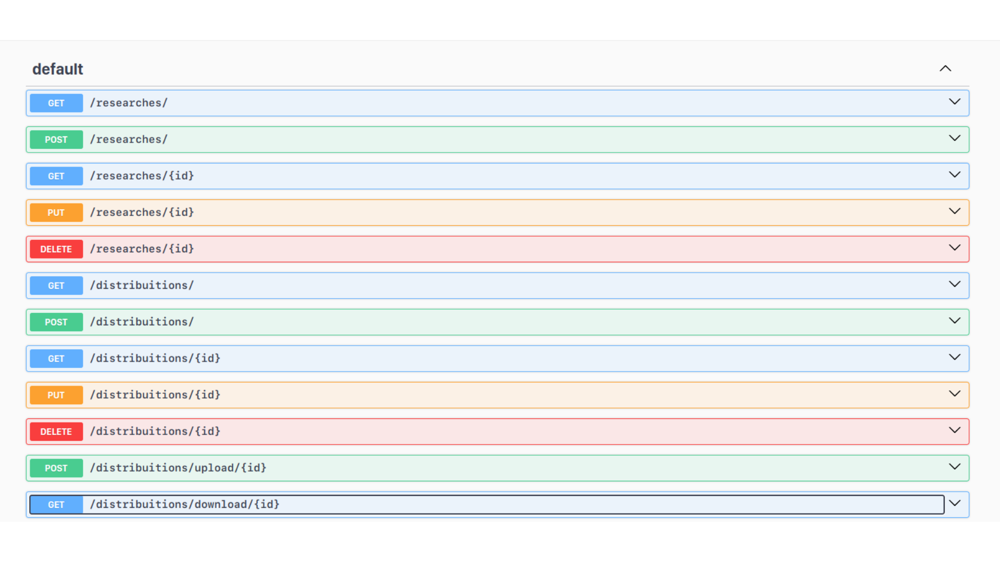

# Backend
## 1. Tecnologias utilizadas
- Node.js
- Express
- Typescript
- Prisma (ORM)
- Postgres

## 2. Instruções para rodar o projeto localmente
Para rodar o back-end localmente, navegue até a pasta backend do projeto (esta pasta) e siga esse passo-a-passo:
1. Execute o comando:
-     npm i
2. Após, execute os seguintes comandos no terminal para executar a imagem Docker:
-     docker pull postgres

3. Neste comando, troque o campo 'mysecretpassword' pela senha do repositório. 
(Para professores, a senha está disponível no Slack da turma.)

-     docker run --name some-postgres -e POSTGRES_PASSWORD=mysecretpassword -d postgres

4. Crie o arquivo `.env` com as credenciais necessárias (disponivel no slack para os professores)
5. Após o processamento das imagens, rode o comando:
-      npm run start

## 3. Instruções para acessar a documentação com Swagger

- O back-end da aplicação está documentado no Swagger. 
- Para acessar, basta rodar a aplicação (veja instruções na seção anterior), abrir o navegador e, na barra de pesquisas, escrever `localhost:8080/api-docs`

